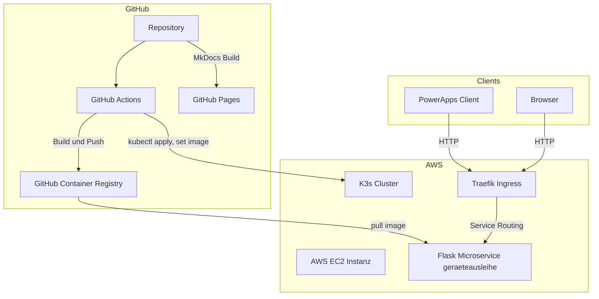

# Technische Dokumentation (fortlaufend)

Repository: https://github.com/Cancani/geraeteausleihe-sem4  
GitHub Pages: https://cancani.com/geraeteausleihe-sem4/  

AWS Region: us east 1  
EC2 Public IP: 13.223.28.53  
Externer Endpoint: http://geraeteausleihe.13.223.28.53.nip.io  

---

## Ziel dieser technischen Dokumentation
Diese technische Dokumentation beschreibt den vollständigen Stand bis Ende Sprint 2. Die Dokumentation wird sich im Laufe des Projekts ständig verändern.
Fokus ist ein lauffähiger End to End Betrieb inklusive Service Code, Tests, Containerisierung, GHCR, AWS EC2, K3s, Kubernetes Ressourcen, GitHub Actions CI und CD sowie nachvollziehbaren Nachweisen.

Alle Aussagen sind so strukturiert, dass sie mit Commands, Outputs oder Screenshots belegt werden können.

---

# Systemübersicht

## Zielbild


## Komponenten
| Komponente | Aufgabe | Hinweis |
| --- | --- | --- |
| PowerApps | Konsument des Microservice | Ruft den PDF Endpoint auf |
| Flask Microservice | REST API und PDF Ausgabe | Läuft containerisiert |
| GitHub Actions | Build, Push, Deploy und Docs | CI CD und GitHub Pages |
| GHCR | Container Images | Versionierung über Tags |
| AWS EC2 | Compute Basis | K3s läuft auf der Instanz |
| K3s | Kubernetes Distribution | Single Node Betrieb |
| Traefik Ingress | HTTP Ingress Controller | Routing auf Service |
| nip.io | DNS Convenience | Hostname ohne eigene DNS Zone |

## Schnittstellen und Endpunkte
| Endpoint | Methode | Zweck | Erwartung |
| --- | --- | --- | --- |
| `/` | GET | Basis Response | Text Response |
| `/healthz` | GET | Health Check | 200 OK mit JSON |
| `/pdf` | GET | PDF Ausgabe für PowerApps | PDF Response mit Content Disposition Attachment |

Externe Verifikation:
```bash
curl -i http://geraeteausleihe.13.223.28.53.nip.io/
curl -i http://geraeteausleihe.13.223.28.53.nip.io/healthz
curl -I "http://geraeteausleihe.13.223.28.53.nip.io/pdf?borrower=Test&device=Notebook&staff=TBZ"
```


---

# Repository Struktur

## Struktur
Wichtige Bereiche im Repository:

- `service/` Python Flask App
- `service/test_api.py` Pytest Tests
- `Dockerfile` Container Image Build
- `.github/workflows/` Workflows für CI, CD, PR Checks, Docs
- `k3s/` Kubernetes Manifeste (Namespace, Deployment, Service, Ingress)
- `docs/` MkDocs Seiten
- `mkdocs.yml` MkDocs Konfiguration

---

# Python Flask Service

## Zweck
Der Service stellt eine REST API bereit und erzeugt PDFs für die Geräteausleihe. Nutzung erfolgt durch PowerApps oder Browser. Der Service läuft lokal und produktionsnah im Container mit gunicorn.

## Konfiguration
Umgebungsvariable:
- `PORT` wird im Kubernetes Deployment auf `8080` gesetzt.

## 3.3 Lokale Ausführung
Beispiel Ablauf:
```bash
cd service
python -m venv .venv
source .venv/bin/activate
pip install -r requirements.txt
python app.py
```

Nachweise:
- ``

## 3.4 Endpoints

### GET /
Erwartung:
- HTTP 200
- Text Response

Nachweis:
```bash
curl -i http://localhost:8080/
```

### GET /healthz
Erwartung:
- HTTP 200
- JSON mit status und timestamp

Nachweis:
```bash
curl -i http://localhost:8080/healthz
```

### GET /pdf
Erwartung:
- HTTP 200
- PDF Response
- Content Disposition Attachment

Nachweis:
```bash
curl -I "http://localhost:8080/pdf?borrower=Test&device=Notebook&staff=IT"
```

---

# Tests

## Ziel
Automatisierte Tests prüfen die wichtigsten API Endpoints. Fokus liegt auf Response Codes, Content Type und Basis Inhalt.

## 4.2 Besonderheiten und Lösung
WeasyPrint benötigt System Libraries. Lokale Tests auf Windows waren dadurch aufwendig. Lösung war, die Tests im Docker Container auszuführen.

Weitere Besonderheit:
- Bytes Assertions mit Umlauten führten zu Syntax Problemen
- Lösung: `response.get_data(as_text=True)`

## Testausführung im Container
```bash
docker build -t geraeteausleihe:test .
docker run --rm geraeteausleihe:test sh -c "pip install pytest && cd /srv && pytest -q -p no:cacheprovider test_api.py"
```

Erwartung:
- Alle Tests erfolgreich,  `5 passed`

Nachweise:
- ``

---

# 5 Containerisierung

## 5.1 Dockerfile Ziel
Das Dockerfile baut ein Image auf Basis `python:3.11-slim`. Es installiert WeasyPrint Abhängigkeiten (pango, cairo, gdk pixbuf und weitere) und startet den Service mit gunicorn.

## 5.2 Lokaler Build und Run
Build:
```bash
docker build -t geraeteausleihe:local .
```

Run:
```bash
docker run --rm -p 8080:8080 geraeteausleihe:local
```

Verifikation:
```bash
curl -i http://localhost:8080/healthz
```

Nachweise:
- ``
- ``

---

# GitHub Container Registry GHCR

## Naming und Tagging
Tags:
- `latest`
- Commit SHA, zum Beispiel `115b431876813ef6867c26de7e7cf6df0c533809`


---

# 7 AWS Setup

## 7.1 EC2 Instanz
Konfiguration:
- Region: us east 1
- OS: Ubuntu 22.04
- Public IP: 13.223.28.53
- Elastic IP verwendet

Nachweise:
- ``

## 7.2 Security Group
Inbound Rules:
- 22 SSH
- 80 HTTP
- optional 443 später

Nachweise:
- ``

---

# 8 K3s Installation und Cluster Zugriff

## 8.1 K3s Installation
K3s wurde manuell installiert. Traefik ist standardmässig aktiv.

Nachweise:
```bash
sudo systemctl status k3s
kubectl get nodes
kubectl get pods -A
```


---

# Kubernetes Ressourcen

## Übersicht
Die App wird über deklarative YAML Manifeste betrieben.

| Manifest | Ressource | Zweck |
| --- | --- | --- |
| `namespace.yaml` | Namespace | Logische Trennung |
| `deployment.yaml` | Deployment | Pods, Rolling Update, Probes |
| `service.yaml` | Service ClusterIP | Interner Zugriff |
| `ingress.yaml` | Ingress | Externer Zugriff über Traefik |

## Namespace
Anwendung:
```bash
kubectl apply -f namespace.yaml
```


## Deployment
Deployment enthält:
- 1 Replica
- containerPort 8080
- env PORT 8080
- readinessProbe auf /healthz
- livenessProbe auf /healthz
- imagePullPolicy Always


## Service


## Ingress
Ingress Host:
- `geraeteausleihe.13.223.28.53.nip.io`


---

# 10 GitHub Actions

## 10.1 Workflow Übersicht
Bis Ende Sprint 2 sind folgende Workflows im Einsatz:

- container-build.yml: Build und Push nach GHCR
- deploy-k3s.yml: Deployment auf EC2 und Rollout Check
- pr-checks.yml: Build, Lint, Tests für PR nach main
- docs-pages.yml: MkDocs Build und Deploy nach gh-pages bei Docs Änderungen auf main


## 10.2 Benötigte Secrets
Erforderlich:
- EC2_HOST
- EC2_USER
- EC2_SSH_KEY


## 10.3 Evidence Workflows
- ``
- ``

---

# 11 Deployment Verifikation

## 11.1 Kubernetes Status
```bash
kubectl -n geraeteausleihe get all
kubectl -n geraeteausleihe get ingress
```

## 11.2 Externe Requests
```bash
curl -f http://geraeteausleihe.13.223.28.53.nip.io/healthz
curl -I "http://geraeteausleihe.13.223.28.53.nip.io/pdf?borrower=Test&device=Notebook&staff=IT"
```

---

# 12 PowerApps Integration

## 12.1 Launch auf PDF Endpoint
PowerApps ruft `/pdf` über Launch auf und nutzt EncodeUrl für borrower, device und staff.

Evidence:
- ``
- ``

---

# 13 Nachweise Sprint 2
Dieser Abschnitt ist die Sammelstelle für Evidence. Screenshots können hier gesammelt und aus Sprint Review oder Issues verlinkt werden.

## 13.1 GHCR
- ``

## 13.2 GitHub Actions
- ``
- ``

## 13.3 Docker und Tests
- ``
- ``

## 13.4 K3s Status
- ``
- ``

## 13.5 Kubernetes Ressourcen
- ``
- ``

## 13.6 Externe curl Nachweise
- ``
- ``

## 13.7 Architektur und CI CD Grafiken
- ``
- ``

## 13.8 Risiko Matrix
- ``

---

# 14 Status Ende Sprint 2
Ende Sprint 2 ist der Service in K3s auf AWS EC2 produktionsnah lauffähig und extern erreichbar.

Checkliste:
- Namespace `geraeteausleihe` existiert
- Deployment läuft und Pods sind Ready
- Service und Ingress sind vorhanden
- Endpoint `http://geraeteausleihe.13.223.28.53.nip.io` liefert /healthz und /pdf
- GHCR enthält Tags latest und Commit SHA
- CI Build und CD Deploy sind als Workflows dokumentiert
- Tests laufen reproduzierbar im Container
