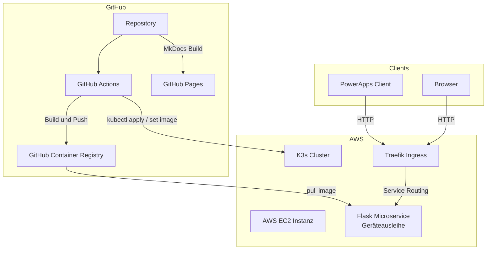

# Architektur

## Zielbild

---

## Komponenten

| Komponente | Aufgabe | Hinweis |
| --- | --- | --- |
| PowerApps | Konsument des Microservice | Ruft den PDF Endpoint auf |
| Flask Microservice | REST API und PDF Ausgabe | Läuft containerisiert |
| GitHub Actions | Build, Push, Deploy und Docs | CI CD und GitHub Pages |
| GHCR | Container Images | Versionierung über Tags |
| AWS EC2 | Compute Basis | K3s läuft auf der Instanz |
| K3s | Kubernetes Distribution | Single Node Betrieb für das Projekt |
| Traefik Ingress | HTTP Ingress Controller | Routing auf Service |
| nip io | DNS Convenience | Hostname ohne eigene DNS Zone |

---

## Schnittstellen und Endpunkte

| Endpoint | Methode | Zweck | Erwartung |
| --- | --- | --- | --- |
| `/health` | GET | Health Check | 200 OK |
| `/pdf` | GET | PDF Ausgabe für PowerApps | PDF Response |

---

## Kubernetes Ressourcen

| Manifest | Ressource | Zweck | Wichtige Punkte |
| --- | --- | --- | --- |
| `k8s/namespace.yaml` | Namespace | Trennung der App Ressourcen | eigener Namespace |
| `k8s/deployment.yaml` | Deployment | Pods und Rolling Update | Image Tag, Probes |
| `k8s/service.yaml` | Service | Interner Zugriff | ClusterIP |
| `k8s/ingress.yaml` | Ingress | Externer Zugriff | Host und Path Routing |

---

## Ingress Host Handling

Für die Erreichbarkeit ohne eigene DNS Zone wird nip io verwendet.

| Element | Beispiel |
| --- | --- |
| Muster | `geraeteausleihe.<EC2_IP>.nip.io` |
| Vorteil | Keine DNS Konfiguration, sofort testbar |
| Nachteil | Nicht geeignet für produktive Umgebungen |

---

## Security und Betrieb

| Bereich | Umsetzung | Offener Ausbau |
| --- | --- | --- |
| Secrets | GitHub Secrets, EC2 SSH, Registry Zugriff | Rotation und Least Privilege |
| Probes | Readiness und Liveness geplant | Grenzwerte und Fehlerfälle testen |
| Logs | Container Logs über kubectl abrufbar | Zentrales Logging optional |
| Rollback | Über Image Tags möglich | Strategie dokumentieren und üben |
