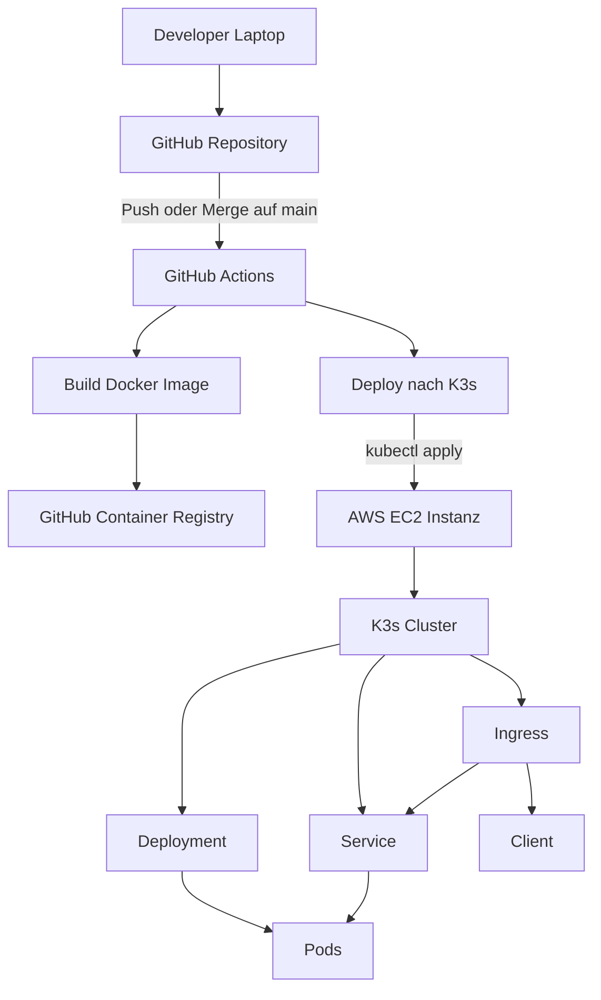

# Architektur

!!! abstract "Kurzüberblick"
    - Laufzeit: K3s Cluster auf einer AWS EC2 Instanz
    - Auslieferung: GitHub Actions baut und deployt nach Push auf `main`
    - Zugriff: Ingress Endpoint (Traefik) leitet auf Service und Pods
    - Artefakte: Container Images in GitHub Container Registry

## Zielbild

Der Microservice wird containerisiert betrieben und über Kubernetes Ressourcen ausgerollt. Änderungen werden über einen automatisierten CI und CD Ablauf bereitgestellt.

## Komponenten

- GitHub Repository (Source Code, Manifeste, Dokumentation)
- GitHub Actions (CI, Build und CD Pipeline)
- GitHub Container Registry (Container Images)
- AWS EC2 Instanz (Host für K3s)
- K3s Cluster (Control Plane und Worker auf einer Instanz)
- Kubernetes Ressourcen (Namespace, Deployment, Service, Ingress)
- Ingress Controller (Traefik)

## Ablauf CI und CD

1. Merge oder Push auf `main`
2. GitHub Actions baut das Docker Image
3. Push nach GHCR mit Tags `latest` und Commit SHA
4. Deployment Job wendet Manifeste an und setzt das Image im Deployment
5. K3s rollt ein Rolling Update der Pods aus
6. Zugriff erfolgt über Ingress Hostname (zum Beispiel via `nip.io`)

## Architektur Diagramm

## Kubernetes Ressourcen

- Namespace: logische Isolation für das Projekt
- Deployment: Replikas, Rolling Updates, Image Referenz
- Service: stabiler Cluster Endpoint zu den Pods
- Ingress: Routing von extern nach intern, Host und Pfad Regeln

## Architektur Entscheide

| Thema | Entscheidung | Begründung |
|---|---|---|
| Kubernetes Distribution | K3s auf EC2 | geringer Setup Aufwand und günstige Ressourcen |
| Container Registry | GHCR | nahtlose Integration in GitHub Actions |
| Deployment Strategie | Rolling Update via Deployment | minimaler Downtime Effekt, standardisiert |
| Ingress | Traefik (K3s default) | out of the box verfügbar, einfache Konfiguration |
