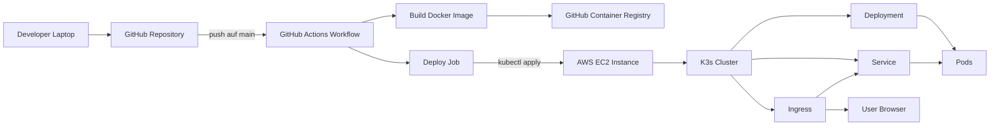

## Architektur Zielbild

### Ziel
Der Microservice wird als Container in Kubernetes betrieben. Ein Push auf main loest Build, Push nach GHCR und Deployment nach K3s aus.

### Komponenten
GitHub Repository  
GitHub Actions  
GitHub Container Registry  
AWS EC2 Instanz  
K3s Cluster  
Ingress Controller  
Kubernetes Ressourcen Deployment, Service, optional Ingress

### Ablauf CI CD
1. Push auf main
2. GitHub Actions baut Docker Image
3. Push nach GHCR mit commit sha Tag
4. GitHub Actions deployt ins K3s Cluster
5. Kubernetes rollt das Deployment aus

### Kubernetes Ressourcen
Deployment  
Steuert Replicas und Rolling Updates

Service  
Stellt die Anwendung intern bereit

Ingress  
Leitet Requests von aussen an den Service weiter

### Entscheidungen
K3s auf EC2 statt EKS wegen geringeren Kosten und weniger Setup Overhead  
Automatisches Deploy um End to End DevOps Ablauf zu zeigen  
Monitoring ist nicht im Scope

## Architektur Diagramm

