# Dokumentation


## Projektdefinition


### Einreichungsformular

Das Einreichungsformular kann hier entnommen werden:  
[ITCNE24 Semesterarbeit 4 Einreichungsformular](./Efekan_Einreichungsformular_4.SemesterV2.docx)

---

### Projektübersicht

| Eigenschaft | Details |
|---|---|
| **Titel** | Geräteausleihe Microservice, Cloud Native Deployment auf AWS |
| **Studierender** | Efekan Demirci |
| **Dozenten** | PRJ Corrado Parisi, CNC Philip Stark |
| **Semester** | 4 Semester HF TBZ, ITCNE24 |
| **Zeitraum** | Oktober 2025 bis Januar 2026 |
| **Technologie Stack** | Python Flask, Docker, K3s auf AWS EC2, GitHub Actions, GHCR, MkDocs |
| **Architektur** | Microservice, Container, Kubernetes Deployment, Ingress Routing |
| **Repository** | https://github.com/Cancani/geraeteausleihe-sem4 |
| **GitHub Pages** | https://cancani.com/geraeteausleihe-sem4/ |
| **Project Board** | https://github.com/users/Cancani/projects/3/views/1 |

Die bestehende Geräteausleihe Lösung aus der vorherigen Semesterarbeit dient als Ausgangsbasis. In dieser Arbeit steht nicht die fachliche Erweiterung im Vordergrund, sondern die Cloud Native Transformation: Containerisierung, automatisierte CI/CD Pipelines sowie der Betrieb in einem Kubernetes Cluster auf AWS.

**Key Features**

* Container Build und Push nach GHCR
* Automatisiertes Deployment nach K3s auf AWS EC2 via GitHub Actions
* Ingress Routing über Traefik und Hostname über nip.io
* Extern erreichbare Endpoints healthz und pdf
* Laufende Dokumentation über MkDocs und GitHub Pages

---

## Ausgangslage und Problemstellung

### Ist Zustand

Der Service war zwar technisch lauffähig, der Betrieb und das Deployment waren jedoch zu wenig standardisiert und zu wenig automatisiert. 

Typische Nachteile im Ist Zustand:
* Deployment Updates waren fehleranfällig und schwer nachvollziehbar
* Kein konsistentes Release und Tagging Konzept
* Keine Kubernetes Eigenschaften wie Self Healing und deklarative Deployments
* Nachweise für Stakeholder fehlten oder wurden erst spät nachgetragen

**Ist Workflow**


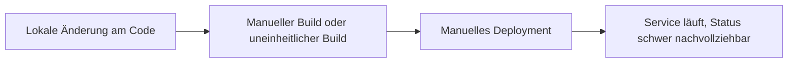

<small><em>Abbildung 1: Ist-Workflow mit manuellen Build- und Deployment-Schritten</em></small>


---

### Soll Zustand

Ziel ist ein durchgängig automatisierter Workflow vom Commit bis zum laufenden Pod im Cluster. Jede relevante Änderung soll ein Image bauen, in die Registry pushen und anschliessend automatisiert im K3s Cluster deployed werden.

**Soll Workflow**


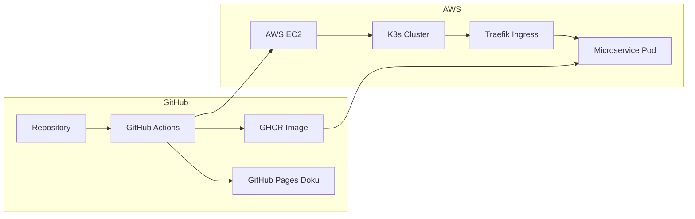

<small><em>Abbildung 2: Soll-Workflow mit automatisiertem CI/CD-Prozess über GitHub Actions und AWS</em></small>

___ 

**Soll Verbesserungen**

| Verbesserung | Nutzen | Umsetzung |
|---|---|---|
| Automatisierter Build und Push | Reproduzierbar, nachvollziehbar | GitHub Actions, GHCR |
| Automatisierter Deploy | Schneller und konsistent | GitHub Actions, kubectl apply |
| Deklarative Kubernetes Manifeste | Standardisiertes Deployment | Namespace, Deployment, Service, Ingress |

---

## Zielsetzung

Die Arbeit hat das Ziel, den bestehenden Microservice in eine Cloud Native Betriebsumgebung zu überfuehren. Der Fokus liegt auf CI und CD, Kubernetes Deployment, stabiler Erreichbarkeit über Ingress sowie einer laufenden Dokumentation, die den Fortschritt und die Qualität belegt.

---

### SMART Ziele

| Ziel | Spezifisch | Messbar | Attraktiv | Realistisch | Terminiert |
|---|---|---|---|---|---|
| CI Build und Push | Container Image wird gebaut und nach GHCR gepusht | Erfolgreiche Actions Runs und sichtbare Tags | DevOps Nutzen | Mit GitHub Actions umsetzbar | Sprint 2 und 3 |
| CD Deploy nach K3s | Manifeste werden applied und Image wird aktualisiert | Pods laufen, Service extern erreichbar | Automatisierung | Mit K3s auf EC2 umsetzbar | Sprint 2 und 3 |
| Ingress und Endpoints | Health und PDF funktionieren extern | HTTP 200, PDF Response | Demo fähig | Traefik und nip.io vorhanden | Sprint 2 |

---

## Technologien und Werkzeuge

| Bereich | Technologie | Begründung |
|---|---|---|
| Backend | Python Flask | Schlankes Framework für Microservices |
| Containerisierung | Docker | Portabilität und reproduzierbarer Betrieb |
| Orchestrierung | K3s | Kubernetes Betrieb auf einer EC2 Instanz |
| Cloud Hosting | AWS EC2 | Realistische Zielumgebung für DevOps Deployment |
| Registry | GHCR | In GitHub integriert, einfache Distribution |
| CI und CD | GitHub Actions | Automatisierung von Build, Push und Deploy |
| Ingress | Traefik | Routing im Cluster und externe Erreichbarkeit |
| Dokumentation | MkDocs, GitHub Pages | Versionierte und laufend publizierte Doku |
| Projektmanagement | GitHub Projects, Issues | Backlog, Schätzungen, Priorisierung, DoD |

---

## Projektmanagement

### Projektmethodik

Das Projekt folgt einem agilen, scrumähnlichen Vorgehen mit iterativer Entwicklung und regelmässigen Review Zyklen. Die Planung und Nachverfolgung erfolgt vollständig in GitHub.

**Gewählte Methodik: Sprint basierte Entwicklung**

Die Entscheidung für ein iteratives Vorgehen basiert auf folgenden Punkten:

* Neue technische Themen wie Kubernetes, K3s und CI CD benötigen experimentelles Vorgehen mit kurzen Feedback Schleifen
* Technische Abhängigkeiten werden oft erst während der Umsetzung sichtbar, zum Beispiel Ingress, Host Routing und Secrets Handling
* Dozenten Feedback kann direkt in die nächsten Tasks und in die Dokumentation einfliessen
* Risiken werden früh sichtbar, statt erst am Schluss

**Kernprinzipien der angewandten Methodik**

* Iterative Entwicklung mit funktionsfähigen Zwischenständen
* Kontinuierliches Feedback und Anpassung der Prioritäten
* Laufende Nachweisführung, damit der Projektstand jederzeit nachvollziehbar ist
* Klare Definition of Done pro Ticket inklusive Evidence Anforderungen

### Sprintstruktur im Detail

**Sprint Planning (Sprintbeginn):**
* Definition von User Stories mit klaren Akzeptanzkriterien
* Aufwandsschätzung in Story Points
* Festlegung des Sprintziels als ein Satz Outcome und der Deliverables
* Sprint Scope im GitHub Project Board zuweisen, Sprint Feld und Milestone setzen

**Sprint Execution (Durchführung):**
* Kontinuierliche Arbeit an den definierten User Stories
* GitHub Issues für Aufgaben Tracking und Statusupdates
* Regelmässige Commits und Pushes, kleine Änderungen statt grosse Sprünge
* Ticket Status aktuell halten, WIP Limit in Progress maximal 2

**Sprint Review (Sprintende):**
* Abgleich gegen Sprintziel
* Review Gespräche mit Dozenten zur Qualitätssicherung
* Bewertung der Zielerreichung und Identifikation von Verbesserungspotenzialen
* Evidence Pflicht, Screenshots und Links werden direkt pro Sprint Review dokumentiert

**Sprint Retrospektive:**
* Reflexion des Arbeitsprozesses mit dem Starfish Modell
* Identifikation von Start Doing, Stop Doing, Keep Doing, More Of, Less Of

**Vorteile der gewählten Methodik:**
* Flexibilität, schnelle Anpassung an neue Erkenntnisse, zum Beispiel Ingress Routing oder CI CD Details
* Qualitätssicherung, regelmässige Reviews verhindern späte Richtungsänderungen
* Motivation, sichtbare Fortschritte nach jedem Sprint
* Lernoptimierung, Retrospektiven führen zu kontinuierlicher Prozessverbesserung

### Projektphasen und Meilensteine

Das Projekt ist in drei Sprints gegliedert. Die Sprintzeiträume entsprechen der ursprünglichen Planung. Inhalte aus Sprint 1 und Sprint 2 wurden in einem späteren Zeitraum konzentriert nachgezogen. Die Dokumentation wird nun strukturiert und evidenzbasiert ergänzt, damit der Stand jederzeit nachvollziehbar ist.

#### Sprint Progression im Überblick

**Sprint 1 Projektbasis:**  
Aufbau der Projektbasis mit Board Struktur, Labels, Milestones, Issue Standards und erstem Architektur Zielbild.

**Sprint 2 Cluster und Deploy:**  
Aufbau der Laufzeitumgebung auf AWS EC2 mit K3s, Kubernetes Ressourcen und Ingress über Traefik. Erste externe Tests der Endpoints.

**Sprint 3 CI CD und Nachweise:**  
Stabilisierung von Build und Deploy Workflows mit GitHub Actions, saubere Versionierung,
 Rollback Vorgehen.
 
 Laufende Nachweise pro Sprint durchgehend.

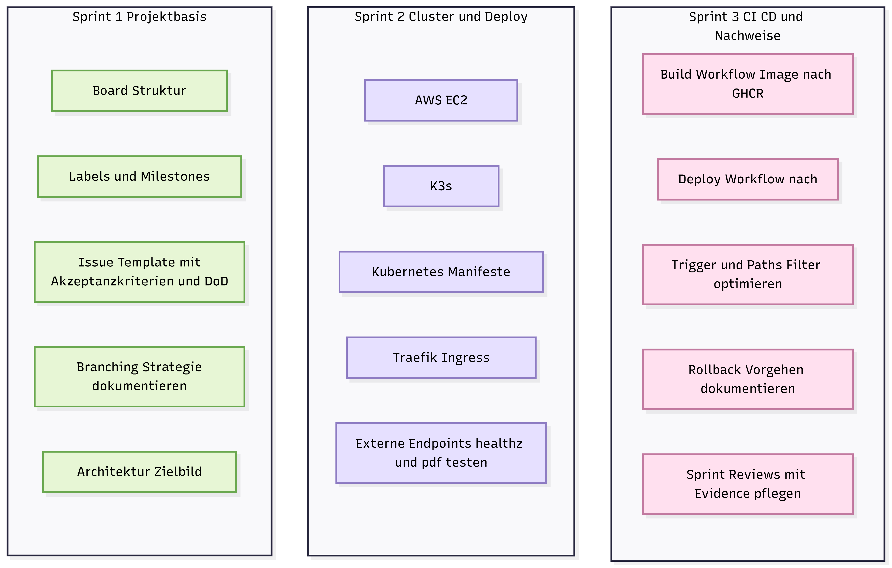

<small><em>Abbildung 3: Sprint-Übersicht im GitHub Project Board</em></small>

#### Zeitplan

| Sprint       | Zeitraum                  | Fokus                                                                                      | Status        |
| ------------ | ------------------------- | ------------------------------------------------------------------------------------------ | ------------- |
| **Sprint 1** | 27.10.2025 bis 17.11.2025 | Projektbasis, Board Setup, Standards, Architektur Zielbild                                 | Abgeschlossen |
| **Sprint 2** | 18.11.2025 bis 15.12.2025 | AWS EC2 und K3s Setup, Kubernetes Manifeste, Ingress, erste externe Tests                  | Abgeschlossen |
| **Sprint 3** | 16.12.2025 bis 21.01.2026 | CI CD stabilisieren, Evidence pro Sprint, Dokumentation Finalisierung, Abgabe Vorbereitung | In Arbeit     |

---

## Anpassung der Sprint Planung

In der praktischen Umsetzung wurden zentrale Inhalte aus Sprint 1 und Sprint 2 in einem späteren Zeitraum konzentriert nachgezogen. Gründe dafür waren parallele Verpflichtungen und die Priorisierung des technischen Fortschritts vor der finalen Dokumentationsform.

Die Sanierung erfolgt durch folgende Massnahmen:

* Backlog wird konsequent priorisiert und geschätzt
* Definition of Done wird strikt eingehalten, closed Tickets werden bei offenen DoD Punkten wieder geöffnet
* Sprint Reviews enthalten ab jetzt konkrete Nachweise, nicht nur Text
* Status Updates erfolgen regelmässig, inklusive Links auf Board und Dokumentation

---

## Issues und User Stories

Das Projekt umfasst 27 User Stories, US01 bis US27. Alle Stories werden als GitHub Issues geführt und im [GitHub Project Board](https://github.com/users/Cancani/projects/3) verwaltet.

### Standards pro Issue

* User Story Text
* Akzeptanzkriterien als Checkboxen
* Definition of Done als Checkboxen
* Labels für Priorität und Bereich
* Milestone Zuordnung zu Sprint

### Project Board Felder

Die Steuerung erfolgt über folgende Felder im GitHub Project:

| Feld | Zweck |
|---|---|
| Status | Backlog, Ready, In Progress, Review, Done |
| Story Points | Aufwandsschätzung |
| Priorität | Must, Should, Could |
| Sprint | Sprint 1, Sprint 2, Sprint 3 |
| DoD erfüllt | Ja, Nein |

### Board Workflow

| Spalte | Bedeutung |
|---|---|
| Backlog | Neue Anforderungen, noch nicht priorisiert |
| Ready | Priorisiert und bereit zur Umsetzung |
| In Progress | Aktive Umsetzung, WIP Limit beachten |
| Review | DoD Kontrolle, Evidence prüfen |
| Done | Abgeschlossen und dokumentiert |

### Aufwandsschätzung und Story Points (Issues und User Stories)

Die Aufwände der einzelnen Issues und User Stories wurden mit Story Points geschätzt.
Story Points stellen bewusst **keine Zeitangaben** dar, sondern dienen als relative Bewertung
von Aufwand, Komplexität und Risiko.

Die Schätzung basiert auf folgenden Kriterien:
- Technische Komplexität der Aufgabe
- Anzahl beteiligter Komponenten (Service, CI/CD, Kubernetes, Cloud)
- Grad der Unsicherheit oder Neuartigkeit der Technologie
- Erwarteter Analyse-, Test- und Debuggingaufwand
- Abhängigkeiten zu anderen Tasks

Es wurde bewusst auf eine Schätzung in Stunden verzichtet,
da diese insbesondere bei technischen Aufgaben mit hohem Lern- und Analyseanteil
eine Scheingenauigkeit erzeugen würde.

### Priorisierung

Die Priorisierung der Issues erfolgt zentral im GitHub Project Board
und ist unabhängig von einzelnen Sprints.
Ziel der Priorisierung ist es,
den Fokus auf fachlich und technisch kritische Aufgaben zu legen
und Abhängigkeiten frühzeitig zu berücksichtigen.

Die Priorisierung basiert auf folgenden Kriterien:
- Technische Abhängigkeiten zu anderen Tasks
- Risiko für den Projektfortschritt oder Betrieb
- Kritikalität für einen lauffähigen End to End Betrieb
- Rückmeldungen und Anforderungen der Dozenten

Die Priorität wird pro Issue explizit festgelegt
und bleibt über mehrere Sprints hinweg sichtbar.
Dadurch ist jederzeit nachvollziehbar,
warum bestimmte Aufgaben früher umgesetzt wurden als andere.

Die Priorisierung wird im Project Board visuell dargestellt.
Issues mit der Priorität **Must** sind im Backlog ganz oben angeordnet,
darunter folgen Issues mit der Priorität **Should**,
während Issues mit der Priorität **Could** bewusst am unteren Ende des Backlogs platziert sind.

Diese Anordnung stellt sicher, dass fachlich und technisch zwingend notwendige Aufgaben jederzeit klar erkennbar sind und zuerst in die Sprint Planung einfliessen.


<small><em>Abbildung 4: Priorisierung im GitHub Project Board</em></small>

---

### Verwendete Story-Point-Skala

| Story Points | Bedeutung |
|-------------|----------|
| 1 | Sehr kleiner Task, klar abgegrenzt, kaum Risiko |
| 2 | Kleiner Task mit überschaubarem Aufwand |
| 3 | Mittlerer Task mit mehreren Schritten oder Abhängigkeiten |
| 5 | Komplexer Task oder neue Technologie mit erhöhtem Debuggingaufwand |
| 8 | Sehr komplexer Task mit hohem Risiko oder vielen Unbekannten |

Die Story Points werden direkt pro Issue im GitHub Project Board gepflegt.
Zusätzlich ist in jedem Issue eine kurze Begründung der Schätzung dokumentiert.
Änderungen an Schätzungen wurden transparent im jeweiligen Issue festgehalten.

---

## Sprint Planungen, Reviews & Retrospektiven

Die nachfolgenden Abschnitte dokumentieren den vollständigen Projektverlauf und machen Fortschritte, Entscheidungen und Herausforderungen transparent nachvollziehbar.

---

### Sprint 1 Planung, Review und Retrospektive

#### Sprint Zeitraum

27.10.2025 bis 17.11.2025

#### Sprintziel

Projektbasis schaffen, damit Fortschritt und Qualität transparent nachvollziehbar sind. Fokus liegt auf Board Setup, Standards und erstem Architektur Zielbild.


<small><em>Abbildung 5: Sprint 1 Meilensteine und Issues</em></small>

---

#### Sprint 1 User Stories

Die folgenden User Stories gehören zu Sprint 1:

[Link zu Issues auf GitHub Projects](https://github.com/Cancani/geraeteausleihe-sem4/milestone/1)

| US | Titel | Bereich | Story Points |
|---|---|---|---|
| US01 | Kanban Board finalisieren | Projektmanagement | 1 |
| US02 | Labels anlegen | Projektmanagement | 1 |
| US03 | Milestones anlegen | Projektmanagement | 1 |
| US04 | Issue Template einrichten | Projektmanagement | 2 |
| US05 | Branching Strategie dokumentieren | Dokumentation | 2 |
| US06 | Sprint 1 Review und Retro dokumentieren | Dokumentation | 2 |
| US07 | Architektur Zielbild skizzieren | Architektur | 3 |

**Geplanter Aufwand Sprint 1:** **12 Story Points**

**WIP Regel**

In Progress maximal 2 parallel laufende Issues.

#### Evidence Standard für Sprint 1

Für Sprint 1 werden mindestens folgende Nachweise geplant:

* Screenshot Project Board Übersicht
* Screenshot Labels
* Screenshot Milestones
* Screenshot Issue Template
* Link zur Branching Dokumentation
* Architektur Zielbild als Diagramm

---

### Sprint 1 Review

**Reviewgespräch Hinweis**
Für Sprint 1 fand kein Reviewgespräch statt. Rückmeldungen und Hinweise wurden schriftlich via Microsoft Teams ausgetauscht.


#### Review Ergebnis

Sprint 1 wurde umgesetzt. Die Projektbasis ist vorhanden und bildet die Grundlage für Sprint 2 und Sprint 3.

| Review Punkt | Ergebnis |
|---|---|
| Board Struktur vorhanden und nachvollziehbar | Erfüllt |
| Labels vorhanden und konsistent genutzt | Erfüllt |
| Milestones für Sprints vorhanden | Erfüllt |
| Issue Template mit Akzeptanzkriterien und DoD vorhanden | Erfüllt |
| Branching Strategie dokumentiert | Erfüllt |
| Architektur Zielbild skizziert | Erfüllt |

**Umgesetzter Aufwand:** **12 von 12 Story Points**


<small><em>Abbildung 6: Abgeschlossene Tasks in Sprint 1</em></small>


#### Board und Planung

* Project Board Overview  


<small><em>Abbildung 7: GitHub Project Board Ansicht für Sprint 1</em></small>

* Labels  


<small><em>Abbildung 8: Issue-Labels zur Kategorisierung</em></small>

* Milestones 


<small><em>Abbildung 9: Meilenstein-Übersicht im Projekt</em></small>

* Issue Template  


<small><em>Abbildung 10: Issue-Template für strukturierte Erfassung</em></small>
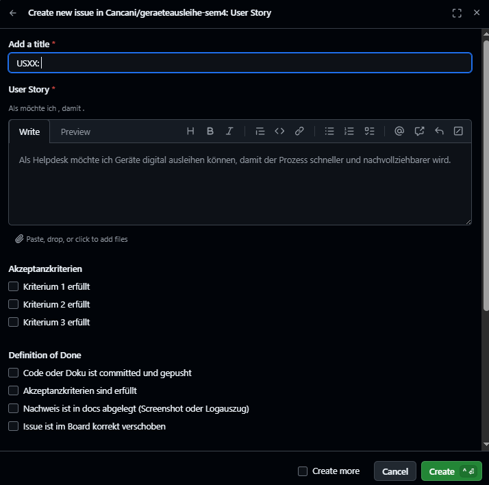

<small><em>Abbildung 11: Issue-Template für strukturierte Erfassung</em></small>


### Sprint 1 Retrospektive


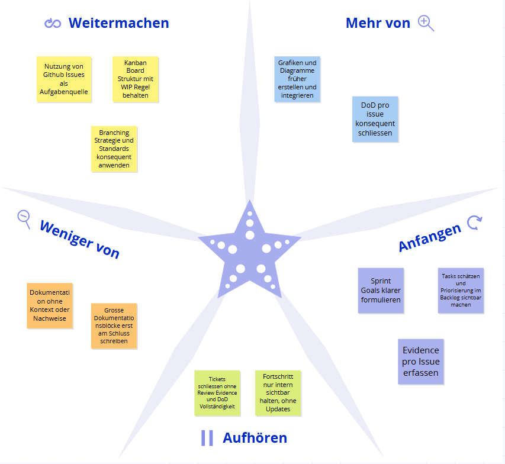

<small><em>Abbildung 12: Starfish Retrospektive Sprint 1</em></small>

Die Retrospektive wurde mithilfe des Starfish-Modells durchgeführt und reflektiert die Erfahrungen des ersten Sprints.

#### Zusammenfassung

Positiv hervorzuheben ist, dass die Projektbasis sauber aufgebaut wurde und damit eine nachvollziehbare Grundlage für die nächsten Sprints entstand. Die Aufgaben wurden konsequent als Issues erfasst, über ein Kanban Board gesteuert und durch definierte Standards wie Akzeptanzkriterien und Definition of Done strukturiert. Dadurch war der Fortschritt bereits in Sprint 1 transparent sichtbar.

Gleichzeitig zeigte Sprint 1, dass Projektmanagement nicht nur aus der Board Struktur besteht, sondern vor allem aus laufender Evidenz und aktiver Kommunikation. Rückmeldungen erfolgten in Sprint 1 ausschliesslich schriftlich via Teams und ohne separates Reviewgespräch. Dadurch fehlte zeitweise eine klare gemeinsame Standortbestimmung. Ebenfalls wurde deutlich, dass Nachweise und Dokumentation früher und kontinuierlicher gepflegt werden müssen, damit Stakeholder den Projektfortschritt jederzeit prüfen können.

Für die kommenden Sprints wurde festgehalten, dass visuelle Hilfsmittel wie Starfish, Risiko Matrix und Architektur Grafiken konsequent eingesetzt werden sollen. Zudem muss Dozentenfeedback nicht nur gelesen, sondern direkt als Issue erfasst, priorisiert und nachvollziehbar umgesetzt werden. Die Sprint Planung soll ausserdem klar definierte Sprint Goals enthalten, welche am Sprintende explizit überprüft werden.

#### Empfehlungen für die nächsten Sprints

- Mehr Zeitpuffer beim Sprintbeginn einplanen und Aufgaben früh schätzen  
- Retrospektiven konsequent visuell dokumentieren und konkrete Massnahmen ableiten  
- Nachweise pro erledigtem Ticket sofort ergänzen und nicht erst am Sprintende  
- Dozentenfeedback direkt als Issue erfassen, priorisieren und mit Belegen abschliessen
  
---

### Sprint 2 Planung

#### Sprint Zeitraum

18.11.2025 bis 15.12.2025 (Wurde am 07.01.2026 durch Feedback von Fachdozenten verbessert)

#### Sprint Ziel

Technische Umsetzung für den Cloud Native Betrieb liefern und gleichzeitig die Nachvollziehbarkeit massiv verbessern. Der Fokus liegt auf einem lauffähigen End to End Betrieb mit Container, GHCR, K3s, Kubernetes und Ingress sowie auf sauberen Nachweisen, realistischen Schätzungen und einem sichtbar priorisierten Backlog.

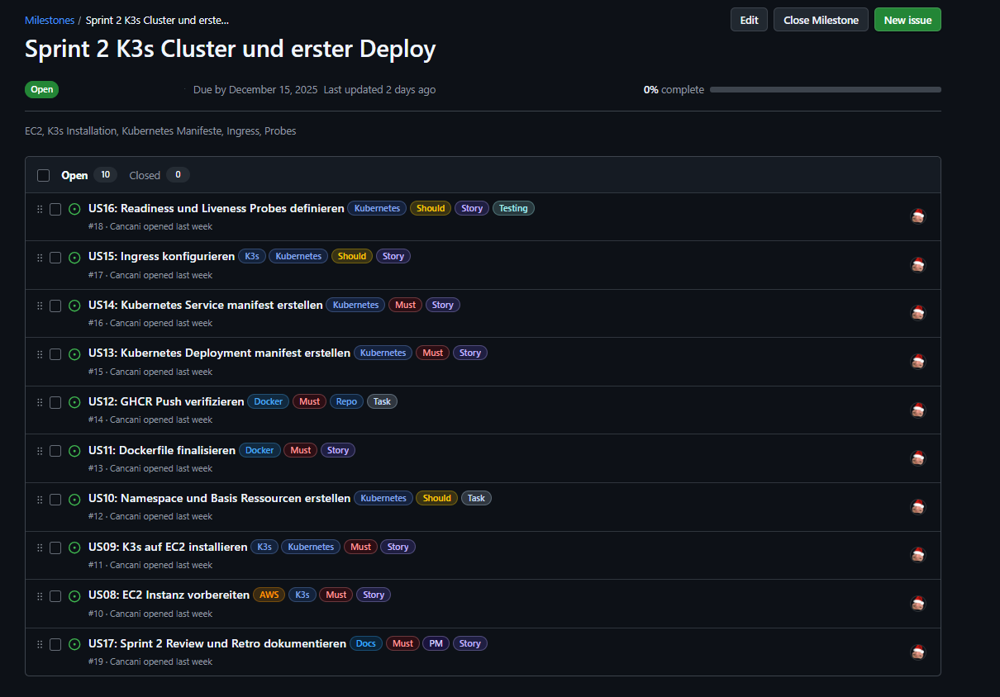

<small><em>Abbildung 13: Sprint 2 Meilensteine und Issues</em></small>

**Reviewgespräch Hinweis**  
Für Sprint 2 fand kein Reviewgespräch statt. Feedback erfolgte schriftlich via Microsoft Teams durch Corrado Parisi.

#### Sprint 2 Scope

Die folgenden Umsetzungspakete gehören zu Sprint 2:

| Bereich | Inhalt |
|---|---|
| Service | Bestehenden Flask Service aufbereiten, Requirements bereinigen und Tests ausführbar machen |
| Containerisierung | Dockerfile erstellen sowie Image lokal bauen und testen |
| Registry | Build und Push nach GitHub Container Registry (GHCR) mit sinnvollen Tags wie latest und Commit SHA |
| Kubernetes | Namespace, Deployment, Service und Ingress Manifeste erstellen |
| Infrastruktur | AWS EC2 bereitstellen, K3s installieren und Traefik Ingress nutzen |
| Deployment | Manuelles Deployment verifizieren und anschliessend GitHub Actions Deployment auf EC2 umsetzen |
| Nachweise | Pro abgeschlossenem Punkt Belege erfassen wie Screenshots, Logs, curl Ausgaben, kubectl Status und Actions Runs |
| PM Verbesserungen | Board Sichtbarkeit sicherstellen, Schätzungen und Priorisierung einführen sowie DoD in Tickets konsequent schliessen |
| Dokumentation | MkDocs Struktur pflegen, Navigation bereinigen und Grafiken ergänzen |

---

#### Sprint 2 User Stories

Die folgenden User Stories gehören zu Sprint 2:

[Link zu Issues auf GitHub Projects](https://github.com/Cancani/geraeteausleihe-sem4/milestone/2)

| US | Titel | Bereich | Story Points |
|---|---|---|---|
| US08 | EC2 Instanz vorbereiten | Infrastruktur | 3 |
| US09 | K3s auf EC2 installieren | Infrastruktur | 5 |
| US10 | Namespace und Basis Ressourcen erstellen | Kubernetes | 2 |
| US11 | Dockerfile finalisieren | Containerisierung | 3 |
| US12 | GHCR Push verifizieren | Registry | 2 |
| US13 | Kubernetes Deployment Manifest erstellen | Kubernetes | 3 |
| US14 | Kubernetes Service Manifest erstellen | Kubernetes | 2 |
| US15 | Ingress konfigurieren | Kubernetes | 5 |
| US16 | Readiness und Liveness Probes definieren | Kubernetes | 3 |
| US17 | Sprint 2 Review und Retro dokumentieren | Dokumentation | 2 |

**Geplanter Aufwand Sprint 2:** **30 Story Points**

#### WIP Regel

In Progress sind maximal zwei parallel laufende Issues erlaubt.


#### Evidence Standard für Sprint 2

Für Sprint 2 werden mindestens folgende Nachweise geplant und laufend in die technische Dokumentation ergänzt:

- Screenshot des GHCR Packages mit Tags latest und Commit SHA  
- Screenshot oder Link zu GitHub Actions Runs für Container Build und Deployment  
- Screenshot oder Output von Docker Build und lokalen Tests mit pytest  
- kubectl get nodes und kubectl get pods -A als Nachweis, dass K3s läuft  
- kubectl -n geraeteausleihe get all und get ingress als Nachweis für ein korrektes Deployment  
- curl Nachweise extern  
  - /healthz  
  - /pdf mit Content Disposition Header  
- Screenshots der relevanten Dokumentationsseiten wie Technische Umsetzung, Projektmanagement und Sprint Review  
- Mindestens eine Grafik für die Architektur und eine Grafik für den CI CD Ablauf  
- Eine Risiko Matrix wird als Grafik erstellt und eingebunden  

---

### Sprint 2 Review

**Reviewgespräch Hinweis**  
Für Sprint 2 fand kein Reviewgespräch statt. Feedback erfolgte schriftlich via Microsoft Teams durch Corrado Parisi.

#### Review Ergebnis

Sprint 2 wurde umgesetzt. Der Microservice läuft stabil auf AWS EC2 in einem K3s Cluster und ist extern über Traefik Ingress erreichbar. Build und Push nach GHCR funktionieren, sowie ein automatisiertes Deployment per GitHub Actions.


| Review Punkt | Ergebnis |
|---|---|
| Service läuft lokal und im Container | Erfüllt |
| Tests sind reproduzierbar im Container ausführbar | Erfüllt |
| Docker Image ist gebaut und lauffähig | Erfüllt |
| GHCR enthält Tags latest und Commit SHA | Erfüllt |
| AWS EC2 bereitgestellt und erreichbar | Erfüllt |
| K3s läuft und kubectl Zugriff ist möglich | Erfüllt |
| Kubernetes Namespace Deployment Service Ingress angewendet | Erfüllt |
| Externer Zugriff über nip.io Host funktioniert | Erfüllt |
| Deployment Workflow setzt Image und prüft Rollout | Erfüllt |
| Nachweise sind zentral dokumentiert | Erfüllt |

**Umgesetzter Aufwand:** **27 von 27 Story Points**


<small><em>Abbildung 14: Abgeschlossene Tasks in Sprint 2</em></small>

---

#### Dozentenfeedback und Einbau in Review

Das schriftliche Feedback von Corrado Parisi wurde im Verlauf von Sprint 2 aktiv verarbeitet und in Dokumentation sowie Projektorganisation integriert. Die folgenden Punkte wurden umgesetzt und sind in der Dokumentation und im Project Board nachvollziehbar.

| Feedback Punkt | Umsetzung in Sprint 2 |
|---|---|
| Risikomatrix fehlt | Risikomatrix erstellt, bewertet und in der Dokumentation eingebunden |
| Board Link liefert 404 und Board ist nicht sichtbar | Project Link aktualisiert und Sichtbarkeit überprüft |
| Sprints sind unterschiedlich lang | Sprintlängen wurden korrigiert |
| Zu wenig Überblick über Projektstand | Massnahmen seit Feedback am Montag, 05.01.2026 umgesetzt, Status und Nachweise werden laufend gepflegt |
| Retro könnte noch mehr Struktur haben | Retrospektive visuell verbessert und klarer dokumentiert |
| Sprint Goals besser formulieren | Sprint Goals in der Dokumentation präziser formuliert und am Sprintende überprüfbar gestaltet |
| Wie schätzt du deine Tasks | Story Points pro Issue dokumentiert und Aufwand transparent gemacht |
| Priorisierung im Backlog sichtbar machen | Issues nach Priorität im Kanban Board sichtbar gemacht und nach Must Should Could gefiltert |

---

### Sprint 2 Retrospektive


<small><em>Abbildung 15: Starfish Retrospektive Sprint 2</em></small>

Die Retrospektive wurde mithilfe des Starfish Modells durchgeführt und reflektiert die Erfahrungen aus Sprint 2. Zusätzlich wurde das schriftliche Dozentenfeedback von Corrado Parisi einbezogen, um konkrete Verbesserungen für Transparenz, Nachvollziehbarkeit und technische Stabilität abzuleiten.

#### Zusammenfassung

Positiv hervorzuheben ist, dass der Cloud Native Betrieb technisch umgesetzt und stabil lauffähig gemacht wurde. Der Flask Microservice läuft containerisiert, Images werden automatisiert nach GHCR gepusht und der Service ist auf AWS EC2 in einem K3s Cluster über Traefik Ingress extern erreichbar. Damit ist der zentrale Sprint 2 Anspruch erfüllt, einen End to end Betrieb aufzubauen, der über reale Requests von aussen verifiziert werden kann. Ebenso wurde die technische Dokumentation deutlich ausgebaut, sodass wichtige Schritte und Entscheide nachvollziehbar sind.

Gleichzeitig zeigte Sprint 2 klar, dass technische Umsetzung allein nicht genügt, wenn der Projektstand für Stakeholder nicht jederzeit sichtbar ist. Corrado hat insbesondere fehlende Transparenz kritisiert, zum Beispiel fehlender Überblick über Ziele und Herausforderungen, ein zeitweise nicht zugängliches Board sowie uneinheitliche Sprintlängen. Diese Punkte wurden aufgenommen und korrigiert. Der Board Link wurde aktualisiert, die Sprintlängen wurden konsistenter gestaltet und der Überblick in der Dokumentation wurde verbessert, indem Status, Ziele und nächste Schritte klarer beschrieben wurden. Zusätzlich wurde die Retrospektive visuell stärker aufbereitet und Sprint Goals wurden präziser formuliert.

Ausserdem wurde deutlich, dass Deploy Automatisierung sehr fehleranfällig ist, wenn Variablen und Image Tags nicht deterministisch gesetzt werden. Mehrere Fehlerquellen entstanden durch falsche Repo und SHA Übernahme und durch unstimmige Workflow Logik. Daraus ergibt sich als wichtiger Lernpunkt, dass CI CD Schritte nicht nur gebaut, sondern auch konsequent mit Rollout Status und externem Health Check verifiziert werden müssen. Im selben Zuge wurde das Thema Schätzung verbessert. Tasks wurden mit Story Points dokumentiert und die Priorisierung im Board wurde sichtbar gemacht, um Abhängigkeiten und kritische Aufgaben zuerst umzusetzen.

Für die kommenden Sprints wurde festgehalten, dass die Kombination aus stabiler Technik und laufender Evidenz der Schlüssel ist. Dozentenfeedback muss früh erfasst, im Backlog sichtbar priorisiert und durch konkrete Anpassungen nachweisbar umgesetzt werden. Der Schwerpunkt liegt in Sprint 3 darauf, Deploy und Betrieb weiter zu stabilisieren, die Dokumentation als zentrale Quelle konsequent weiterzuführen und den Projektstatus für Dozenten dauerhaft transparent zu halten.

---

### Sprint 3 Planung

#### Sprint Zeitraum

15.12.2025 bis 21.01.2026 (Terminorientiert wegen Gespräch mit Corrado am 13.01.2026)

#### Sprint Ziel

CI und CD für den Cloud Native Betrieb stabil und nachvollziehbar umsetzen. Fokus liegt auf einem reproduzierbaren Build und Push nach GHCR, einem automatischen Deployment nach K3s auf AWS EC2, klarer Tagging Strategie sowie einer vollständigen technischen Dokumentation als Basis für das Gespräch mit Corrado.


<small><em>Abbildung 16: Sprint 3 Meilensteine und Issues</em></small>

**Reviewgespräch Hinweis**  
Für Sprint 3 ist ein Gespräch mit Corrado am 13.01.2026 geplant. Ziel ist es, bis dahin einen stabilen Stand inklusive Nachweisen und Dokumentation vorzeigen zu können.

#### Sprint 3 Scope

Die folgenden Umsetzungspakete gehören zu Sprint 3:

| Bereich | Inhalt |
|---|---|
| CI Build | GitHub Actions Build robust machen und nur bei relevanten Änderungen ausführen |
| Registry | Push nach GHCR mit konsistenten Tags wie latest und Commit SHA sowie lowercase Repository |
| Secrets | Zugriff für GHCR und EC2 sauber über GitHub Secrets abbilden und testen |
| CD Deployment | Automatisches Deployment nach K3s via Workflow, inkl. apply, set image, rollout status |
| Tagging | Tagging Strategie definieren und konsistent in Build und Deploy anwenden |
| Tests und Checks | Pipeline Testlauf als Nachweis dokumentieren, inklusive Logs und Outputs |
| Dokumentation | Technische Dokumentation zu CI, CD und Betrieb aktualisieren und prüfbar machen |

---

#### Sprint 3 User Stories

Die folgenden User Stories gehören zu Sprint 3:

[Link zu Issues auf GitHub Projects](https://github.com/Cancani/geraeteausleihe-sem4/milestone/3)

| US | Titel | Bereich | Story Points |
|---|---|---|---|
| US18 | GitHub Actions Build und Push nach GHCR | CI | 5 |
| US19 | Secrets für GHCR und Cluster Zugriff einrichten | Security | 3 |
| US20 | CD Workflow deployt nach K3s | Kubernetes | 5 |
| US21 | Tagging Strategie dokumentieren und anwenden | Repo | 3 |
| US22 | Pipeline Testlauf dokumentieren | Testing | 3 |
| US23 | Sprint 3 Review und Retro dokumentieren | PM | 2 |

**Geplanter Aufwand Sprint 3:** **21 Story Points**

#### WIP Regel

In Progress sind maximal zwei parallel laufende Issues erlaubt.

#### Evidence Standard für Sprint 3

Für Sprint 3 werden mindestens folgende Nachweise geplant und laufend in die technische Dokumentation ergänzt:

* Screenshot oder Link zu GitHub Actions Run für Build und Push nach GHCR  
* Screenshot GHCR Package mit latest und Commit SHA Tag  
* Screenshot oder Link zu Deploy Workflow Run inklusive Logs  
* Output von kubectl get pods und kubectl rollout status als Rollout Nachweis  
* Screenshot oder Output der gesetzten Image Version im Deployment  
* Externer Health Check Nachweis über den Ingress Host  
  * http://geraeteausleihe.13.223.28.53.nip.io/healthz  
* Dokumentierte Tagging Strategie mit Begründung  
* Dokumentierter Pipeline Testlauf als End to End Nachweis  

---


### Sprint 3 Review

**Sprint Review mit Parisi Corrado 13.01.2026**

**Reviewgespräch Hinweis**  
Für Sprint 3 fand ein Reviewgespräch mit Corrado Parisi am 13.01.2026 statt. Im Gespräch wurde der aktuelle Stand der Projektdokumentation und des GitHub Projekts gemeinsam geprüft und direkt Feedback dazu gegeben.

#### Kontext

Im Call wurde vor allem der aktuelle Stand der Dokumentation, die GitHub Pages Darstellung sowie das GitHub Project Board besprochen. Corrado hat sich die Änderungen während des Calls angesehen und Rückmeldungen zur Qualität, Nachvollziehbarkeit und Präsentation des Projektstands gegeben.

#### Positive Rückmeldungen

1. Die Dokumentation wirkt deutlich verbessert und übersichtlicher als zuvor.
2. Die Navigation wurde adressiert und wirkt jetzt deutlich besser.
3. GitHub Pages ist als zentrale Seite sehr sinnvoll, weil alles an einem Ort ist und kein Wechsel zwischen Tools nötig ist.
4. Der Workflow über Pull Requests wurde als sauberer Prozess gelobt.
5. Ergänzungen wie die Risikomatrix wurden ausdrücklich positiv bewertet.
6. Insgesamt wurde bestätigt, dass damit viele Punkte gewonnen werden können und dass der Stand nach viel Arbeit aussieht.

#### Projektmanagement und Board

1. WIP Regel ist vorhanden und sinnvoll, konkret maximal 2 parallele Issues.
2. Schätzungen wurden thematisiert und als sinnvoll bewertet.
3. Fibonacci Sequenz für Story Points wurde als passend bestätigt, weil es um relative Grössen und nicht um exakte Zeiten geht.
4. Empfehlung: Prioritäten und Schätzungen direkt auf den Karten im GitHub Board sichtbar machen, zum Beispiel über Labels, damit es für Dritte sofort ersichtlich ist. Dazu soll ein Screenshot in die Dokumentation.

#### Dokumentation und Nachweise

1. Sprint Review Logik wurde angesprochen: pro Sprint klar zeigen, welche Ziele geplant waren und wie sie erreicht wurden.
2. Wenn ein Ziel nicht erreicht wird, ist das okay. Es soll sauber dokumentiert werden, inklusive was in den nächsten Sprint wandert.
3. Hyperlinks als Nachweis sind optional, können aber helfen, wenn es sinnvoll ist.

#### Risikomatrix

1. Risikomatrix soll laufend gepflegt werden.
2. Zusätzliche Idee: Risiko Entwicklung über Zeit visualisieren, damit erkennbar wird, ob Risiken kleiner oder grösser werden. Dazu soll ein Beispiel Screenshot geliefert werden.

#### Vorschläge für zusätzliche Verbesserungen

1. Burndown Chart wäre ein starker Zusatz, falls GitHub Projects das unterstützt oder sich alternativ darstellen lässt.
2. Eine kurze Demo als GIF aufnehmen und in die Dokumentation einbauen, damit der Effekt sofort sichtbar ist. Philipp soll dabei explizit markiert werden.

#### Inhaltliche Detailkritik

1. Ein kleiner Punkt im Use Case Bereich: ein Eintrag wie Deployment System wirkt dort eventuell nicht passend platziert und könnte optisch besser umgeordnet werden.

#### Review Ergebnis

Sprint 3 ist inhaltlich und technisch auf einem stabilen Stand. CI Build und Push nach GHCR sind nachvollziehbar, CD Deployment nach K3s läuft und die Nachweise sind zentral über GitHub Pages auffindbar. Das Review hat bestätigt, dass der Projektstand deutlich professioneller wirkt, insbesondere durch die strukturierte Dokumentation, den Pull Request Workflow und die Ergänzungen im Projektmanagement.

| Review Punkt | Ergebnis |
|---|---|
| Dokumentation strukturierter und besser navigierbar | Erfüllt |
| GitHub Pages als zentrale Projektseite sinnvoll genutzt | Erfüllt |
| Pull Request Workflow konsequent eingesetzt | Erfüllt |
| WIP Limit und Schätzungen etabliert | Erfüllt |
| Risikomatrix vorhanden und nachvollziehbar | Erfüllt |
| CI Build und Push nach GHCR stabil und nachvollziehbar | Erfüllt |
| CD Deployment nach K3s lauffähig und prüfbar | Erfüllt |
| Evidence Ablage pro Sprint umgesetzt und ausbaufähig | Teilweise, laufend |

**Umgesetzter Aufwand:** **21 von 21 Story Points**

#### Sprint 3 User Stories und Status

| User Story | Titel | Status | Nachweis |
|---|---|---|---|
| US18 | GitHub Actions Build und Push nach GHCR | Erledigt | GitHub Actions Run, GHCR Package Tags |
| US19 | Secrets für GHCR und Cluster Zugriff einrichten | Erledigt | GitHub Secrets gesetzt, Deploy Run mit SSH und SCP |
| US20 | CD Workflow deployt nach K3s | Erledigt | Deploy Run, kubectl Status, Ingress erreichbar |
| US21 | Tagging Strategie dokumentieren und anwenden | Erledigt | Tags latest und Commit SHA, lowercase Repo |
| US22 | Pipeline Testlauf dokumentieren | Erledigt | Logs, kubectl Outputs, externe Requests |
| US23 | Sprint 3 Review und Retro dokumentieren | Erledigt | Dieser Abschnitt, Retro ergänzt |

#### Offene Punkte und nächste Schritte

1. Burndown Chart Darstellung im GitHub Projekt prüfen und falls möglich ergänzen.
2. Optional eine sehr kurze Demo als GIF erstellen und in die Dokumentation einbauen, Philipp dabei markieren.
3. Risiko Entwicklung Visualisierung prüfen, Beispiel kommt via Screenshot.
4. Use Case Darstellung optisch prüfen und Eintrag Deployment System passend umordnen.

#### Nachweise und Screenshots für Sprint 3

1. Screenshot GitHub Actions Run Build und Push
2. Screenshot GitHub Actions Run Deploy
3. Screenshot GHCR Package mit latest und Commit SHA
4. Screenshot kubectl get all im Namespace geraeteausleihe
5. Screenshot kubectl get ingress im Namespace geraeteausleihe
6. Screenshot externer Health Check Request auf /healthz
7. Screenshot GitHub Project Board mit sichtbaren Labels für Priorität und Story Points

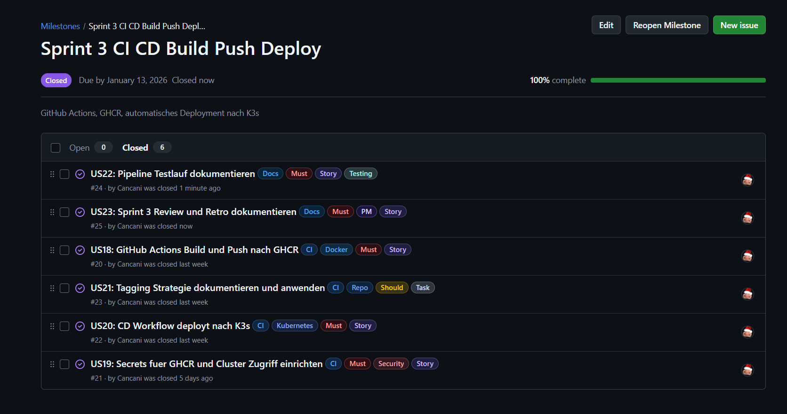

<small><em>Abbildung 17: Sprint 3 Meilensteine und Issues</em></small>


### Sprint 3 Retrospektive

Die Retrospektive wurde mithilfe des Starfish Modells durchgeführt und reflektiert die Erfahrungen aus Sprint 3, inklusive des Feedbacks aus dem Reviewgespräch mit Corrado Parisi.


<small><em>Abbildung 18: Starfish Retrospektive Sprint 3</em></small>

#### Start Doing

1. Kurze visuelle Nachweise ergänzen, zum Beispiel eine Mini Demo als GIF.
2. Risiko Entwicklung über Zeit als Visualisierung prüfen und einbauen, damit Fortschritt bei Risiken sichtbar wird.

#### Stop Doing

1. Platzhalter Überschriften wie Screenshots hinzufügen ohne direkte Umsetzung stehen lassen.
2. Uneinheitliche Begriffe in Board und Doku verwenden, zum Beispiel unterschiedliche Namen für dieselben Artefakte.

#### Keep Doing

1. Pull Request Workflow beibehalten, weil er Nachvollziehbarkeit und Qualität erhöht.
2. GitHub Pages als zentrale Projektseite beibehalten, weil Dozenten und Stakeholder damit alles an einem Ort prüfen können.
3. WIP Limit maximal 2 beibehalten, weil es Fokus und Durchsatz verbessert.
4. End to End Verifikation regelmässig durchführen, kubectl Status plus externe Requests.

#### More Of

1. Visualisierung und klare Sprint Ziele mit messbaren Ergebnissen, damit Reviews schneller prüfbar sind.
2. Projektmanagement Nachweise weiter ausbauen, zum Beispiel Board Screenshot pro Sprint mit sichtbaren Prioritäten und Schätzungen.
3. Kleine, reproduzierbare Commands und Outputs als Evidence, statt lange Freitexte.

#### Less Of

1. Manuelle Server Eingriffe ohne dokumentierten Grund und ohne Nachweis.
2. Späte Dokumentations Updates kurz vor Reviews, stattdessen kontinuierlich.

#### Fazit

Sprint 3 hat bestätigt, dass die Kombination aus stabiler Technik und sichtbarer Evidence entscheidend ist. Das Review Feedback hat vor allem die starke Verbesserung der Dokumentation und des Workflows bestätigt. Der wichtigste nächste Schritt ist, den Projektstand für Dritte noch schneller erfassbar zu machen, insbesondere über sichtbare Prioritäten und Schätzungen im Board sowie zusätzliche visuelle Evidence.

  
---


## Verwaltung der Aufgaben

Die Aufgaben wurden vollständig in [GitHub Projects](https://github.com/users/Cancani/projects/3/views/1) organisiert.  
Das Board ist nach Sprints gegliedert und orientiert sich an der Kanban-Struktur mit den Spalten  
**Backlog**, **Ready**, **In Progress**, **Review** und **Done**.  

Jede Aufgabe ist als **GitHub Issue** (US01 – US27) angelegt und enthält:
- eine klare **User Story**,
- **Akzeptanzkriterien** und **Definition of Done** als Checkboxen,
- eine **Priorität** (Must / Should / Could),
- die Zuordnung zum **Sprint** als Milestone


<small><em>Abbildung 19: GitHub Project Board Gesamtansicht</em></small>

Der Fortschritt ist über das Board jederzeit nachvollziehbar:  
Geschlossene Issues wandern automatisch nach „Done“, offene bleiben in „Review“, bis alle DoD-Kriterien erfüllt und Nachweise in der Dokumentation ergänzt sind.  
Diese Struktur sorgt für durchgängige Transparenz im gesamten Projektmanagementprozess.

---

## Wechsel von GitLab zu GitHub Projects und Issues

### Hintergrund

Zu Beginn der Semesterarbeit 4 wurde die Projektplanung zunächst provisorisch in GitLab vorbereitet, da das Tool visuell bekannt war und bereits in früheren Arbeiten genutzt wurde.  
Mit dem Start der technischen Umsetzung erfolgte jedoch der Umstieg auf **GitHub Projects**, um Code, Doku und Aufgabenverwaltung auf einer Plattform zu bündeln.  

Durch diesen Wechsel konnten alle User Stories direkt mit Commits, Pull Requests und Actions-Runs verknüpft werden.  
Damit war es erstmals möglich, Planung, Automatisierung und Deployment vollständig integriert zu führen.

---

### Gründe für den Wechsel

- **Zentrale Plattform:** Code, Doku und Tasks an einem Ort  
- **Nachvollziehbarkeit:** Verknüpfung von Issues, Commits und Deployments  
- **Automatisierung:** Actions können Status oder Nachweise direkt aktualisieren  
- **Klarer Prozess:** Backlog → Sprint → Review → Done (identisch mit Planner, aber nachvollziehbar versioniert)  
- **GitHub Labels und Milestones:** Ersetzen Buckets und Fälligkeitsdaten aus Planner  
- **Synchronität mit CI/CD:** Automatische Workflows binden den Projektfortschritt direkt an den technischen Build Prozess  


---

### Fazit

Der Wechsel zu GitHub Projects und Issues hat sich als entscheidender Schritt erwiesen.  
Er ermöglicht einen durchgängigen Arbeitsfluss zwischen Code, Automation und Projektmanagement, ohne Tool-Brüche.  
Zudem ist die Nachweisführung durch Screenshots, Actions-Runs und verlinkte Dokumentation klar prüfbar und Versionen lassen sich über Commit-SHAs direkt nachvollziehen.

---

## SWOT-Analyse

Die SWOT-Analyse fasst die internen und externen Faktoren des Projekts zusammen und dient zur Bewertung der technologischen Tragfähigkeit und prozessualen Stabilität. Die SWOT-Analyse bietet einen strukturierten Überblick über die internen Stärken und Schwächen sowie die externen Chancen und Risiken des Projekts. Ziel ist es, das Projekt im Hinblick auf seine technologische, organisatorische und strategische Tragfähigkeit zu reflektieren.


<small><em>Abbildung 20: SWOT-Analyse für Projektstrategie</em></small>

### Stärken

- **Cloud Native Architektur**
  - Kubernetes ermöglicht skalierbaren und stabilen Betrieb
  - Self Healing durch automatische Pod Neustarts

- **Automatisierte CI/CD Pipeline**
  - Build, Push und Deployment laufen vollautomatisch
  - Reduktion von manuellen Fehlern bei Deployments

- **Moderne DevOps Praktiken**
  - Infrastructure as Code Denkweise
  - Versionierte Deployments über GitHub Container Registry

- **Technologie Unabhängigkeit**
  - Kein Vendor Lock In wie bei proprietären Plattformen
  - Offene Standards (Docker, Kubernetes, GitHub Actions)

- **Saubere Dokumentation**
  - Projektmanagement und Technik transparent dokumentiert
  - GitHub Pages ermöglicht jederzeitigen Zugriff


### Schwächen

- **Erhöhte Komplexität**
  - Kubernetes und CI/CD erfordern tiefere Einarbeitung
  - Höherer initialer Setup Aufwand

- **Single Node Setup**
  - K3s läuft auf einer einzelnen EC2 Instanz
  - Keine echte Hochverfügbarkeit

- **Betriebsverantwortung**
  - Wartung und Updates liegen vollständig beim Betreiber
  - Monitoring und Alerting nur rudimentär umgesetzt

- **Kein Managed Service**
  - Im Vergleich zu EKS mehr manueller Aufwand
  - Sicherheitsupdates müssen selbst geplant werden

### Chancen

- **Skalierbarkeit für Zukunft**
  - Erweiterung auf Multi Node Cluster möglich
  - Einfache Integration weiterer Microservices

- **Übertragbarkeit auf reale Projekte**
  - Architektur entspricht modernen Unternehmensstandards
  - Direkter Praxisbezug für DevOps und Cloud Rollen

- **Automatisierungspotenzial**
  - Erweiterbar um Monitoring, Logging und Alerts
  - GitOps Ansatz später möglich

- **Weiterentwicklung der Anwendung**
  - Anbindung weiterer Systeme oder Services
  - Trennung von Frontend und Backend möglich

- **Wiederverwendbarkeit**
  - Pipeline und Kubernetes Manifeste können für andere Projekte genutzt werden


### Risiken

- **Fehlkonfigurationen**
  - Fehler in Kubernetes Manifests können Service Ausfall verursachen
  - Sicherheitsrelevante Fehlkonfigurationen möglich

- **Kostenrisiken**
  - AWS EC2 Kosten bei längerem Betrieb
  - Speicher und Traffic Kosten bei Skalierung

- **Know how Abhängigkeit**
  - Betrieb erfordert Kubernetes und Linux Wissen
  - Fehlende Erfahrung kann zu Ausfällen führen

- **Zeitliche Überforderung**
  - Parallel laufende Module können Zeitdruck erzeugen
  - Debugging von CI/CD kann zeitintensiv sein


### Fazit der SWOT Analyse

Die Cloud Native Umsetzung bietet klare Vorteile in Bezug auf Automatisierung, Skalierbarkeit und Wartbarkeit.  
Die erhöhte technische Komplexität und der manuelle Betriebsaufwand stellen jedoch Herausforderungen dar.  
Insgesamt überwiegen die Stärken und Chancen, insbesondere im Hinblick auf Lerngewinn und Praxisnähe für moderne IT Betriebsmodelle.


---

## Use-Case Diagramm

Das Use-Case Diagramm zeigt die Akteure und Interaktionen mit dem Geräteausleihe-System aus technischer Sicht.  
Die Zielgruppe sind vor allem Stakeholder, die den Betrieb oder die Integration bewerten möchten.


<small><em>Abbildung 21: Use-Case-Diagramm der Systeminteraktionen</em></small>

### Akteure

| Akteur | Rolle | Berechtigung | Hauptfunktionen |
|--------|-------|---------------|-----------------|
| **Developer / Student** | Projektverantwortlicher | Vollzugriff auf Repo und Cluster | Code, Deploy, Doku |
| **Fachdozent** | Reviewer | Leserechte auf Board und Repo | Sprint Reviews, Feedback |
| **AWS System** | Infrastruktur | Cluster Hosting und Networking | CI/CD Zielsystem |
| **GitHub Actions** | Automatisierung | Build, Push, Deploy | Workflows, Status, Rollbacks |
| **Nutzer (PowerApps)** | Externer Konsument | Zugriff auf /healthz und /pdf | Nutzung der API |

---

### Use-Cases im Detail

| Use-Case | Beschreibung | Akteur | Priorität |
|-----------|--------------|---------|-----------|
| **UC1** | Codeänderung pushen | Developer | Hoch |
| **UC2** | Workflow ausführen | GitHub Actions | Hoch |
| **UC3** | Container bauen und pushen | GitHub Actions / GHCR | Hoch |
| **UC4** | Deployment auf K3s durchführen | GitHub Actions | Hoch |
| **UC5** | Service testen über /healthz | Nutzer / Dozent | Hoch |
| **UC6** | PDF-Endpoint überprüfen | Nutzer / Dozent | Mittel |
| **UC7** | Rollback auf älteres Image durchführen | Developer | Mittel |
| **UC8** | Dokumentation aktualisieren und deployen | GitHub Actions | Mittel |

---

### Externe System-Integrationen

| System | Beschreibung | Use-Cases | Schnittstelle |
|---------|---------------|------------|----------------|
| **GitHub Actions** | CI/CD-Automatisierung | UC1 – UC4, UC8 | Workflow-YAML |
| **GHCR** | Container Registry für Images | UC3 – UC4 | Docker API |
| **AWS EC2** | Hostet den K3s Cluster | UC4 – UC7 | SSH / kubectl |
| **K3s Cluster** | Kubernetes Runtime | UC4 – UC7 | API Server |
| **PowerApps** | Client Frontend für Nutzer | UC5 – UC6 | HTTP GET |
| **GitHub Pages** | Dokumentationshosting | UC8 | Static Site Deploy |

---

### Geschäftsregeln und technische Constraints

**Berechtigungen:**
- Nur der Developer darf Deployments ausführen.
- Dozenten haben Leserechte auf Board, Repo und Doku.
- GitHub Actions arbeitet mit SSH-Key und Secret Authentication.

**Regeln für Deployments:**
- Nur Änderungen am Build Kontext lösen einen Container Build aus. Dazu gehören `service/`, `Dockerfile` und Dependency Dateien im Service Kontext.
- Deployments erfolgen nur auf dem Branch `main`.  
- Erfolgreiche Deployments werden in der Doku unter Evidence pro Sprint nachgewiesen.

**Technische Constraints:**
- Cluster: Einzelinstanz K3s auf AWS EC2 t3.medium  
- Registry: GHCR öffentlich lesbar, privat schreibgeschützt  
- Keine Persistenz im Cluster, da State nicht Teil des Projekts  
- Keine TLS Zertifikate, da nip.io Host für interne Demo

---

## Risikomatrix

Die Risikomatrix dient zur strukturierten Bewertung potenzieller Risiken im Projekt.

Bewertet werden Risiken aus den Bereichen **Infrastruktur, Kubernetes, CI/CD, Sicherheit und Betrieb**.  
Die Kombination aus Eintrittswahrscheinlichkeit und Auswirkung zeigt die Dringlichkeit notwendiger Gegenmassnahmen.

**(Stand 07.01.2026)**

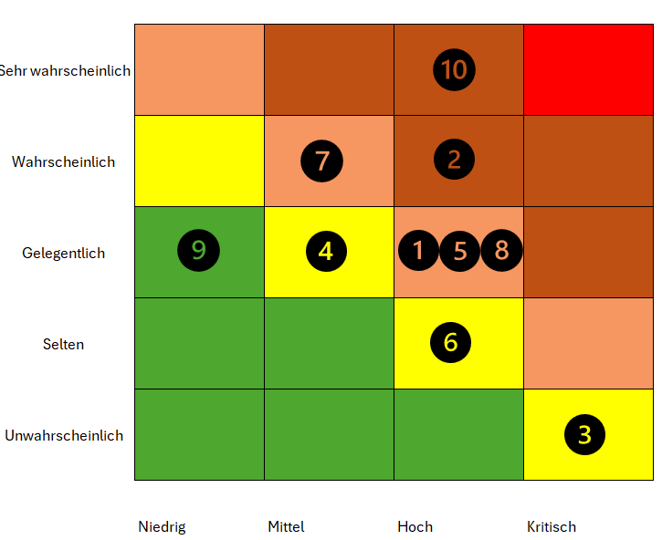

<small><em>Abbildung 22: Risikomatrix mit identifizierten Projektrisiken</em></small>


### Achsenbeschreibung

- **Y-Achse:** Eintrittswahrscheinlichkeit  
  (Unwahrscheinlich → Sehr wahrscheinlich)

- **X-Achse:** Auswirkung  
  (Niedrig → Kritisch)

### Farbbedeutung

- 🟩 Grün: Geringes Risiko  
- 🟨 Gelb: Akzeptables Risiko  
- 🟧 Orange: Erhöhtes Risiko  
- 🔴 Rot: Kritisches Risiko

---

### Risiken im Detail

| Nr. | Risiko                                                                 | Eintritt        | Auswirkung | Bewertung | Massnahme / Lösung |
|----:|------------------------------------------------------------------------|-----------------|------------|-----------|--------------------|
| 1 | Fehlkonfiguration von Kubernetes Manifests (Pods starten nicht) | Gelegentlich | Hoch | Orange | Manifeste schrittweise testen, `kubectl apply --dry-run`, Logs prüfen |
| 2 | CI Pipeline schlägt fehl durch falsche Secrets oder Tokens | Wahrscheinlich | Mittel | Orange | Secrets früh testen, klare Namenskonventionen, Test Runs |
| 3 | Kein Zugriff auf EC2 Instanz (SSH Key verloren oder Security Group Fehler) | Unwahrscheinlich | Kritisch | Gelb | SSH Keys sichern, Dokumentation der Zugänge, Fallback Zugriff |
| 4 | Container Image wird nicht korrekt nach GHCR gepusht | Gelegentlich | Mittel | Gelb | Image Tags prüfen, lowercase Repo Namen erzwingen |
| 5 | Ingress ist falsch konfiguriert, Service nicht erreichbar | Gelegentlich | Hoch | Orange | Ingress separat testen, Logs des Ingress Controllers prüfen |
| 6 | K3s Dienst oder Node fällt aus (Single Node Setup) | Selten | Hoch | Gelb | Neustart Strategien dokumentieren, Risiko bewusst akzeptieren |
| 7 | Fehlende Health Checks führen zu instabilem Betrieb | Wahrscheinlich | Mittel | Orange | Readiness und Liveness Probes definieren |
| 8 | Fehlerhafte CI/CD Änderung deployed fehlerhafte Version | Gelegentlich | Hoch | Orange | Deployment nur über main, saubere Reviews, Rollback via Image Tag |
| 9 | Dokumentation nicht aktuell zum Projektstand | Gelegentlich | Niedrig | Grün | Doku als Teil der Definition of Done |
| 10 | Zeitmangel durch parallele Module und Aufgaben | Sehr Wahrscheinlich | Hoch | Rot | Priorisierung auf Kernanforderungen, Sprint Planung strikt einhalten |

---

### Einordnung in die Risikomatrix

Die Risiken wurden in der Risikomatrix wie folgt positioniert:

- **Orange (erhöhtes Risiko):** 1, 2, 5, 7, 8  
- **Gelb (akzeptables Risiko):** 3, 4, 6  
- **Grün (geringes Risiko):** 9  
- **Rot (kritisch):** 10


---

### Fazit

- Insgesamt wurden 10 projektrelevante Risiken identifiziert und bewertet.
- Mehrere Risiken befinden sich im orangefarbenen Bereich, was die erhöhte technische Komplexität von Kubernetes und CI/CD widerspiegelt.
- Ein Risiko (Nr. 10: Zeitmangel durch parallele Module und Aufgaben) wurde bewusst als **kritisch (rot)** eingestuft, da die zeitlichen Rahmenbedingungen während des Semesters eine reale und hohe Gefahr darstellen.
- Dieses Risiko wird durch klare Priorisierung der Kernanforderungen, Sprint-Planung sowie konsequente Fokussierung auf Mindestanforderungen aktiv adressiert.
- Insgesamt bleibt das Risikoprofil trotz des identifizierten kritischen Risikos kontrollierbar und angemessen für ein praxisorientiertes Lernprojekt.

## Architektur

Die folgenden Abschnitte erklären die drei Diagramme inhaltlich und bezogen auf dein aktuelles Setup mit GitHub, GHCR, AWS EC2, K3s und Traefik Ingress. Externe Erreichbarkeit erfolgt über den Host `geraeteausleihe.<EC2_IP>.nip.io`, die wichtigsten Endpoints sind `/healthz` und `/pdf`.

### Deployment Ablauf

Dieses Diagramm zeigt den Ablauf einer Änderung vom Commit bis zum erfolgreichen Rollout im K3s Cluster.

1. Entwickler pusht Änderungen auf den Branch `main` im GitHub Repository.  
2. GitHub triggert den GitHub Actions Workflow aufgrund des Push Events.  
3. GitHub Actions baut ein neues Docker Image aus dem aktuellen Repository Stand. Dabei wird der Service reproduzierbar erstellt, inklusive Abhängigkeiten.  
4. Das erzeugte Image wird in die GitHub Container Registry GHCR gepusht. Als Tag wird ein eindeutiger Wert genutzt, typischerweise die Commit SHA, damit jede Version klar nachvollziehbar ist.  
5. Danach startet der Deploy Schritt. GitHub Actions authentifiziert sich auf die AWS EC2 Instanz, auf der K3s läuft. In deinem Setup passiert das üblicherweise über SSH zur EC2 Instanz und anschliessend über `kubectl` Befehle im richtigen Cluster Kontext.  
6. Mit `kubectl apply` werden die Kubernetes Manifeste angewendet oder aktualisiert. Damit sind Namespace, Deployment, Service und Ingress definiert.  
7. K3s führt ein Rolling Update durch. Neue Pods werden gestartet, Readiness greift, danach werden alte Pods beendet. Der Service bleibt während des Updates erreichbar.  
8. Der Workflow prüft den Rollout Status. Bei Erfolg gilt das Deployment als abgeschlossen. Optional kann danach zusätzlich ein externer Smoke Test erfolgen, zum Beispiel ein Request auf `http://geraeteausleihe.<EC2_IP>.nip.io/healthz`.

Kernaussage: Jeder Push auf `main` erzeugt eine neue deployte Version. Der Commit SHA Tag in GHCR dient als Nachweis, welche Version gerade produktiv läuft und ermöglicht ein sauberes Rollback auf eine frühere Version.

**Sequenzdiagramm**


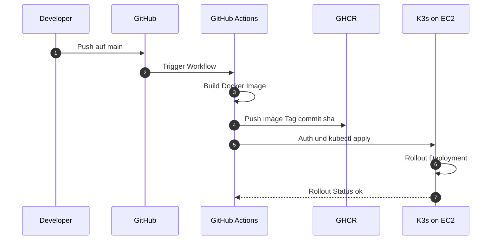

<small><em>Abbildung 23: Sequenzdiagramm des Sprint-Zyklus</em></small>
___

### Flowchart LR Komponenten und Datenfluss von Entwicklung bis Nutzerzugriff

Dieses Diagramm zeigt die Systemlandschaft und den Datenfluss von links nach rechts, also vom lokalen Arbeiten bis zum Aufruf durch Nutzer.

1. Der Entwickler arbeitet lokal am Service, an den Kubernetes Manifesten und an den Workflows.  
2. Der Code wird ins GitHub Repository gepusht. Das Repository ist die zentrale Quelle für Source Code, `k3s/` Manifeste und Workflows unter `.github/workflows`.  
3. Bei einem Push auf `main` startet GitHub Actions.  
4. GitHub Actions baut das Docker Image und pusht es nach GHCR. Dadurch ist das Artefakt zentral verfügbar und eindeutig versioniert.  
5. Anschliessend führt GitHub Actions den Deploy Job aus und verbindet sich mit der AWS EC2 Instanz, auf der K3s läuft.  
6. In K3s existiert ein Namespace `geraeteausleihe`. Dort laufen Deployment, Pods, Service und Ingress.  
7. Der Ingress wird über Traefik bereitgestellt. Er nimmt externe HTTP Requests an, matched Host und Pfade und leitet den Traffic intern an den Service weiter.  
8. Der Service verteilt den Traffic auf die laufenden Pods. Die Pods beantworten die Requests, zum Beispiel `/healthz` für den Health Check und `/pdf` für die PDF Ausgabe.  
9. Der Nutzer greift extern über `geraeteausleihe.<EC2_IP>.nip.io` zu. nip.io löst den Host automatisch auf die EC2 IP auf und ersetzt damit eine klassische DNS Konfiguration.

Kernaussage: Das Diagramm zeigt die saubere Trennung zwischen Artefakt Ebene und Laufzeit Ebene. Das Image entsteht und lebt in GHCR, die Ausführung erfolgt in K3s als Pods, gesteuert durch deklarative Manifeste.


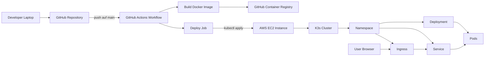

<small><em>Abbildung 24: Soll-Workflow mit automatisiertem CI/CD-Prozess über GitHub Actions und AWS</em></small>

---

### Flowchart TB interne Kubernetes Struktur im Cluster

Dieses Diagramm zoomt in den K3s Cluster hinein und zeigt die internen Kubernetes Objekte und deren Rollen.

1. K3s ist die Kubernetes Laufzeitplattform auf deiner AWS EC2 Instanz. Sie übernimmt Scheduling, Rollouts, Self Healing und Cluster Networking.  
2. Im Cluster existiert der Namespace `geraeteausleihe`. Er dient der logischen Trennung, verbessert die Übersicht und erleichtert die Wartung.  
3. Das Deployment beschreibt, welches Container Image laufen soll, wie viele Replikate gewünscht sind und welche Ports und Einstellungen der Service braucht.  
4. Aus dem Deployment entsteht ein ReplicaSet. Das ReplicaSet stellt sicher, dass die gewünschte Anzahl Pods wirklich läuft. Fällt ein Pod aus, wird automatisch ein neuer erstellt.  
5. Die Pods sind die eigentlichen Instanzen deines Flask Microservice. Dort laufen die Endpoints `/healthz` und `/pdf`.  
6. Der Service vom Typ ClusterIP stellt eine interne stabile Adresse bereit und verteilt Requests an die Pods anhand von Labels.  
7. Der Ingress Controller Traefik nimmt externe Requests entgegen. Er leitet sie anhand von Regeln im Ingress Objekt an den Service weiter.  
8. Der Nutzer spricht nur den Ingress an. Alles danach passiert intern über Service und Pod Networking.

Kernaussage: Extern sichtbar ist der Ingress, intern bleibt die Applikation über Service und Deployment abstrahiert. Das entspricht der erwarteten Kubernetes Struktur für stabile Deployments und Rolling Updates.


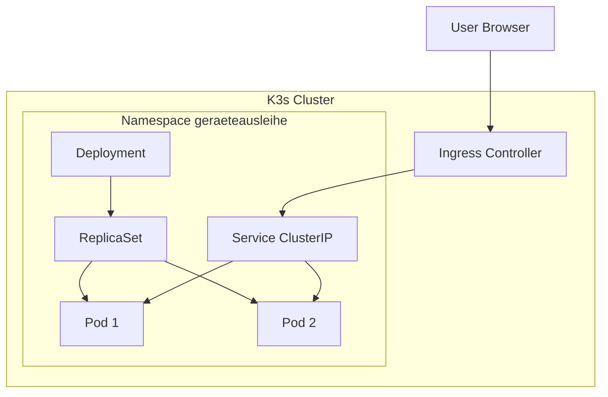

<small><em>Abbildung 25: Prozessdiagramm</em></small>


## Ingress Host Handling

Für die Erreichbarkeit ohne eigene DNS Zone wird nip.io verwendet.

| Element | Beispiel |
| --- | --- |
| Muster | `geraeteausleihe.<EC2_IP>.nip.io` |
| Vorteil | Keine DNS Konfiguration, sofort testbar |
| Nachteil | Nicht geeignet für produktive Umgebungen |

---

## Security und Betrieb

| Bereich | Umsetzung | Offener Ausbau |
| --- | --- | --- |
| Secrets | GitHub Secrets, EC2 SSH, Registry Zugriff | Rotation und Least Privilege |
| Probes | Readiness und Liveness geplant | Grenzwerte und Fehlerfälle testen |
| Logs | Container Logs über kubectl abrufbar | Zentrales Logging optional |
| Rollback | Über Image Tags möglich | Strategie dokumentieren und üben |

---

## Branching Strategie und Regeln

### Ziel
Die Branching Strategie stellt sicher, dass der **main Branch jederzeit stabil** ist und den Stand für Demo und Abgabe abbildet. Entwicklung und laufende Arbeiten erfolgen auf **develop** oder auf **feature branches**. Die Dokumentation wird über GitHub Pages aus dem Repository veröffentlicht.

### Branches

- **main**
  - Stabiler Stand für Sprint Reviews, Demo und Abgabe
  - Änderungen erfolgen nur über Pull Requests
  - Keine direkten Pushes, sofern Branch Regeln aktiv sind

- **develop**
  - Integrationsbranch für laufende Entwicklung
  - Feature branches werden zuerst nach develop gemerged
  - develop dient als Sammelpunkt bis zum stabilen Merge nach main

- **feature branches**
  - Kurzlebige branches für einzelne Themen oder Issues
  - Namensschema Empfehlung:
    - `feature/us08-ec2-setup`
    - `feature/us09-k3s-install`
    - `feature/us20-ci-cd-deploy`
  - Nach Abschluss wird per Pull Request nach develop gemerged

- **gh-pages**
  - Enthält die generierte GitHub Pages Ausgabe
  - Wird ausschliesslich durch den GitHub Actions Workflow aktualisiert
  - Keine manuelle Bearbeitung


### Merge Flow

- **Feature Umsetzung**
  - feature branch wird von develop erstellt
  - Pull Request von feature nach develop
  - Review und Checks, dann Merge

- **Sprint Stand oder Release**
  - Pull Request von develop nach main
  - main wird nur gemerged, wenn der Stand stabil ist

### Regeln und Schutz

- **main**
  - Force Push blockiert
  - Direkte Pushes blockiert, Merge nur über Pull Request
  - Status Checks müssen bestehen, falls Workflows definiert sind

- **develop**
  - Direkte Pushes erlaubt, aber bevorzugt über Pull Requests
  - Force Push blockiert, falls Regeln aktiv sind

- **gh-pages**
  - Branch ist geschützt
  - Updates erfolgen nur über den GitHub Actions Workflow
  - Keine manuellen Pushes

### Dokumentation und GitHub Pages
Die GitHub Pages Dokumentation wird aus dem Repository gebaut. Der Workflow wird nur ausgeführt, wenn relevante Dateien geändert wurden, zum Beispiel `docs` oder `mkdocs.yml`. Dadurch bleibt die Pages Ausgabe konsistent mit dem Stand auf main.

### Commit Konvention
Konvention: `type(scope): message`

Beispiele:
- **docs(pm):** add sprint 1 review and retrospective
- **docs(arch):** add target architecture overview
- **ci(pages):** enable docs deployment workflow
- **ci(cd):** deploy to k3s on push to main
- **feat(k3s):** add deployment and service manifests
- **fix(ci):** correct ghcr image tag
- **chore:** update dependencies

### Definition of Done für Branching Doku
- **Dokumentation ist committed und gepusht**
- **Merge Flow ist nachvollziehbar beschrieben**
- **Branch Regeln sind dokumentiert**
- **Issue US05 ist im Board auf Done**


## Technische Dokumentation (fortlaufend)

Repository: https://github.com/Cancani/geraeteausleihe-sem4  
GitHub Pages: https://cancani.com/geraeteausleihe-sem4/  

AWS Region: us-east-1  
EC2 Public IP: 13.223.28.53  
Externer Endpoint: http://geraeteausleihe.13.223.28.53.nip.io  

---

### Ziel dieser technischen Dokumentation
Diese technische Dokumentation beschreibt den vollständigen Stand bis Ende Sprint 2. Die Dokumentation wird sich im Laufe des Projekts ständig verändern.
Fokus ist ein lauffähiger End to End Betrieb inklusive Service Code, Tests, Containerisierung, GHCR, AWS EC2, K3s, Kubernetes Ressourcen, GitHub Actions CI und CD sowie nachvollziehbaren Nachweisen.

Alle Aussagen sind so strukturiert, dass sie mit Commands, Outputs oder Screenshots belegt werden können.

---

## Systemübersicht

### Zielbild
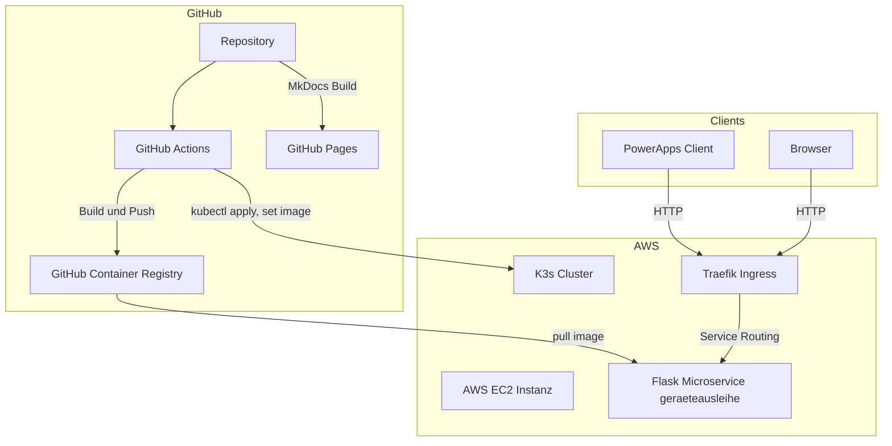

<small><em>Abbildung 26: Soll-Workflow mit automatisiertem CI/CD-Prozess über GitHub Actions und AWS</em></small>

### Komponenten
| Komponente | Aufgabe | Hinweis |
| --- | --- | --- |
| PowerApps | Konsument des Microservice | Ruft den PDF Endpoint auf |
| Flask Microservice | REST API und PDF Ausgabe | Läuft containerisiert |
| GitHub Actions | Build, Push, Deploy und Docs | CI CD und GitHub Pages |
| GHCR | Container Images | Versionierung über Tags |
| AWS EC2 | Compute Basis | K3s läuft auf der Instanz |
| K3s | Kubernetes Distribution | Single Node Betrieb |
| Traefik Ingress | HTTP Ingress Controller | Routing auf Service |
| nip.io | DNS Convenience | Hostname ohne eigene DNS Zone |

### Schnittstellen und Endpunkte
| Endpoint | Methode | Zweck | Erwartung |
| --- | --- | --- | --- |
| `/` | GET | Basis Response | Text Response |
| `/healthz` | GET | Health Check | 200 OK mit JSON |
| `/pdf` | GET | PDF Ausgabe für PowerApps | PDF Response mit Content Disposition Attachment |

Externe Verifikation:
```bash
curl -i http://geraeteausleihe.13.223.28.53.nip.io/
curl -i http://geraeteausleihe.13.223.28.53.nip.io/healthz
curl -I "http://geraeteausleihe.13.223.28.53.nip.io/pdf?borrower=Test&device=Notebook&staff=TBZ"
```


<small><em>Abbildung 27: Curl Commands Endpoints</em></small>

---

## Repository Struktur

### Struktur
Wichtige Bereiche im Repository:

- `service/` Python Flask App
- `service/test_api.py` Pytest Tests
- `Dockerfile` Container Image Build
- `.github/workflows/` Workflows für CI, CD, PR Checks, Docs
- `k3s/` Kubernetes Manifeste (Namespace, Deployment, Service, Ingress)
- `docs/` MkDocs Seiten
- `mkdocs.yml` MkDocs Konfiguration

---

## Python Flask Service

### Zweck
Der Service stellt eine REST API bereit und erzeugt PDFs für die Geräteausleihe. Nutzung erfolgt durch PowerApps oder Browser. Der Service läuft lokal und produktionsnah im Container mit gunicorn.

### Konfiguration
Umgebungsvariable:
- `PORT` wird im Kubernetes Deployment auf `8080` gesetzt.

### Ausführung Lokal

```bash
cd service
python -m venv .venv
source .venv/bin/activate
pip install -r requirements.txt
python app.py
```


## Endpoints

### GET /
Erwartung:
- HTTP 200
- Text Response


```bash
curl -i http://localhost:8080/
```


<small><em>Abbildung 28: GET / Lokal</em></small>

### GET /healthz
Erwartung:
- HTTP 200
- JSON mit status und timestamp


```bash
curl -i http://localhost:8080/healthz
```


<small><em>Abbildung 29: Health Check Endpoint Verifikation</em></small>

### GET /pdf
Erwartung:
- HTTP 200
- PDF Response
- Content Disposition Attachment


```bash
curl -I "http://localhost:8080/pdf?borrower=Test&device=Notebook&staff=IT"
```

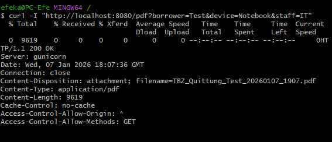

<small><em>Abbildung 30: PDF Generator Endpoint Test</em></small>

---

## Tests

### Ziel
Automatisierte Tests prüfen die wichtigsten API Endpoints. Fokus liegt auf Response Codes, Content Type und Basis Inhalt.

### Besonderheiten und Lösung
WeasyPrint benötigt System Libraries. Lokale Tests auf Windows waren dadurch aufwendig. Lösung war, die Tests im Docker Container auszuführen.

Weitere Besonderheit:
- Bytes Assertions mit Umlauten führten zu Syntax Problemen
- Lösung: `response.get_data(as_text=True)`

### Testausführung im Container
```bash
docker build -t geraeteausleihe:test .
docker run --rm geraeteausleihe:test sh -c "pip install pytest && cd /srv && pytest -q -p no:cacheprovider test_api.py"
```

Erwartung:
- Alle Tests erfolgreich,  `5 passed`


<small><em>Abbildung 31: Unit Tests mit Pytest</em></small>

---

## Containerisierung

### Dockerfile Ziel
Das Dockerfile baut ein Image auf Basis `python:3.11-slim`. Es installiert WeasyPrint Abhängigkeiten (pango, cairo, gdk pixbuf und weitere) und startet den Service mit gunicorn.

### Lokaler Build und Run
Build:
```bash
docker build -t geraeteausleihe:local .
```

Test im Container:
```bash
docker run --rm -p 8080:8080 geraeteausleihe:local
```

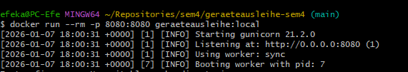

<small><em>Abbildung 32: Docker Container Verifikation</em></small>

Verifikation:
```bash
curl -i http://localhost:8080/healthz
```


<small><em>Abbildung 33: Verifikation Container</em></small>

---

## GitHub Container Registry GHCR

### Naming und Tagging
Tags:
- `latest`
- Commit SHA, zum Beispiel `115b431876813ef6867c26de7e7cf6df0c533809`


<small><em>Abbildung 34: GitHub Container Registry Tags</em></small>

---

## AWS Setup

### EC2 Instanz
Konfiguration:
- Region: us east 1
- OS: Ubuntu 22.04
- Public IP: 13.223.28.53
- Elastic IP verwendet


### Security Group
Inbound Rules:
- 22 SSH
- 80 HTTP
- optional 443 später

Neben den Inbound Regeln der Security Group wurden folgende Host und Zugriffs Massnahmen umgesetzt bzw. als Standard definiert, damit der Zugriff auf die EC2 Instanz kontrolliert bleibt.

### Host Hardening und Zugriff

1. SSH Zugriff erfolgt mit Key Authentisierung, kein Passwort Login
2. Root Login ist deaktiviert, Administration erfolgt über einen dedizierten Benutzer mit sudo
3. SSH ist auf definierte Quell IP Adressen eingeschränkt, sofern im jeweiligen Netzwerk möglich
4. Offen nach aussen sind nur die zwingend benötigten Ports für SSH und HTTP Ingress Traffic
5. Applikations Pods sind nicht direkt exponiert, Zugriff erfolgt nur über Ingress via Traefik

### Abgrenzung Demo Setup und produktiver Betrieb

Dieses Setup ist als Lern und Demo Umgebung ausgelegt. Folgende Punkte sind bewusst nicht umgesetzt und müssen für Produktion ergänzt werden.

1. TLS ist nicht aktiviert, da nip.io verwendet wird und der Fokus auf der Deploy Nachvollziehbarkeit liegt  
   Für Produktion ist TLS via cert manager und validem DNS zwingend
2. Kein umfassendes Cluster Hardening wie Network Policies oder Pod Security Standards, da Single Node K3s  
   Für Produktion sollten mindestens Pod Security, Namespace Isolation und Network Policies bewertet werden
3. Secrets Management ist im Projekt schlank gehalten  
   Für Produktion wäre ein dediziertes Secret Management wie SOPS oder ein Vault Ansatz sinnvoll

---

## K3s Installation und Cluster Zugriff

### K3s Installation
K3s wurde manuell installiert. Traefik ist standardmässig aktiv.

Nachweise:
```bash
sudo systemctl status k3s
kubectl get nodes
kubectl get pods -A
```


<small><em>Abbildung 35: K3s Cluster Status</em></small>
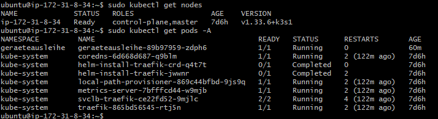

<small><em>Abbildung 36: kubectl Kommandozeilenausgabe</em></small>

---

## Kubernetes Ressourcen

Die App wird über deklarative YAML Manifeste in K3s betrieben. Die Ressourcen sind versioniert im Repository und werden durch GitHub Actions auf die EC2 Instanz ausgerollt.

| Manifest | Ressource | Zweck | Wichtige Punkte |
| --- | --- | --- | --- |
| `k3s/namespace.yaml` | Namespace | Logische Trennung der App Ressourcen | eigener Namespace für bessere Übersicht |
| `k3s/deployment.yaml` | Deployment | Pods, Rolling Update, Probes | Image Tag, Readiness und Liveness auf `/healthz` |
| `k3s/service.yaml` | Service ClusterIP | Interner Zugriff | stabile interne Adresse für die Pods |
| `k3s/ingress.yaml` | Ingress | Externer Zugriff über Traefik | Host Routing über nip.io |

## Namespace

Anwendung:

```bash
kubectl apply -f k3s/namespace.yaml
kubectl get ns geraeteausleihe
```

## Deployment

Anwendung und Kontrolle:

```bash
kubectl apply -f k3s/deployment.yaml
kubectl -n geraeteausleihe rollout status deployment/geraeteausleihe
kubectl -n geraeteausleihe get pods -o wide
```

Wesentliche Konfiguration im Deployment:

| Element | Wert |
| --- | --- |
| Container Port | 8080 |
| Environment Variable PORT | 8080 |
| Readiness Probe | GET `/healthz` |
| Liveness Probe | GET `/healthz` |
| Image Pull Policy | Always |

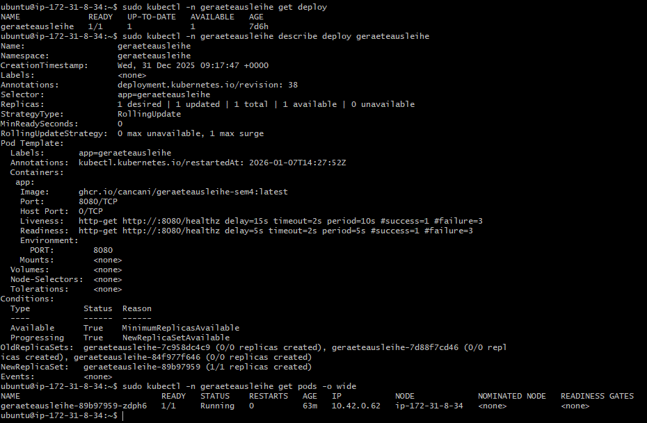

<small><em>Abbildung 37: Kubernetes Deployment Konfiguration</em></small>

## Service

Anwendung und Kontrolle:

```bash
kubectl apply -f k3s/service.yaml
kubectl -n geraeteausleihe get svc
```

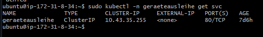

<small><em>Abbildung 38: Kubernetes Service Konfiguration</em></small>

## Ingress

Anwendung und Kontrolle:

```bash
kubectl apply -f k3s/ingress.yaml
kubectl -n geraeteausleihe get ingress
```

Ingress Host: `geraeteausleihe.<EC2_IP>.nip.io`

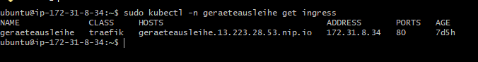

<small><em>Abbildung 39: Kubernetes Ingress Routing</em></small>

## GitHub Actions

### Workflow Übersicht
Folgende Workflows sind im Einsatz:

- container-build.yml: Build und Push nach GHCR
- deploy-k3s.yml: Deployment auf EC2 und Rollout Check
- pr-checks.yml: Build, Lint, Tests für PR nach main
- docs-pages.yml: MkDocs Build und Deploy nach gh-pages bei Docs Änderungen auf main


<small><em>Abbildung 40: Workflows</em></small>

### Benötigte Secrets
Erforderlich:
- EC2_HOST
- EC2_USER
- EC2_SSH_KEY


<small><em>Abbildung 41: GitHub Secrets Konfiguration</em></small>

---

## Deployment Verifikation

### Kubernetes Status
```bash
kubectl -n geraeteausleihe get all
kubectl -n geraeteausleihe get ingress
```


<small><em>Abbildung 42: Kubernetes Status</em></small>


### Externe Requests
```bash
curl -f http://geraeteausleihe.13.223.28.53.nip.io/healthz
curl -I "http://geraeteausleihe.13.223.28.53.nip.io/pdf?borrower=Test&device=Notebook&staff=IT"
```


<small><em>Abbildung 43: Externe Requests</em></small>

## Observability

Observability ist bewusst schlank gehalten und basiert auf Kubernetes Standardmitteln. Ziel ist, dass Betrieb und Fehlersuche ohne zusätzliche Plattform Komponenten nachvollziehbar möglich sind.

### Logging und Events

1. Applikations Logs laufen nach stdout und stderr und werden über Kubernetes bereitgestellt
2. Logs pro Pod prüfen
   1. `kubectl -n <namespace> logs deploy/<deployment-name>`
   2. `kubectl -n <namespace> logs <pod-name> --previous` bei Neustarts
3. Events und Status prüfen
   1. `kubectl -n <namespace> get pods`
   2. `kubectl -n <namespace> describe pod <pod-name>`
   3. Typische Hinweise sind ImagePullBackOff, CrashLoopBackOff, OOMKilled oder fehlende Readiness

### Health Checks

1. Der Service stellt einen Health Endpoint bereit für eine einfache Verfügbarkeitsprüfung
2. Für stabilen Betrieb sind Readiness und Liveness Probes vorgesehen, damit Traffic nur an gesunde Pods geht und defekte Pods automatisch neu gestartet werden

### Monitoring und Metriken

1. Ein zentrales Monitoring Stack ist im Demo Setup nicht integriert
2. Für produktiven Betrieb wären Prometheus und Grafana sinnvoll, inklusive Alerts für
   1. HTTP Fehlerquote
   2. Latenz
   3. Pod Restarts
   4. Ressourcen Auslastung

---

## PowerApps Integration

### Launch auf PDF Endpoint
PowerApps ruft `/pdf` über Launch auf und nutzt EncodeUrl für borrower, device und staff.

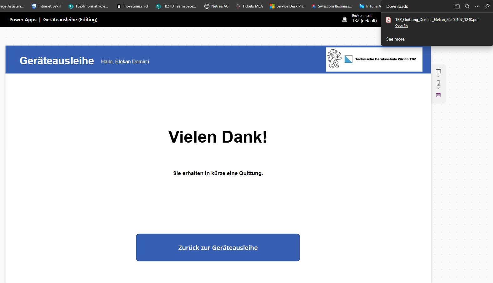

<small><em>Abbildung 44: PDF Generator Endpoint Test</em></small>

**Ausgegebene Quittung**

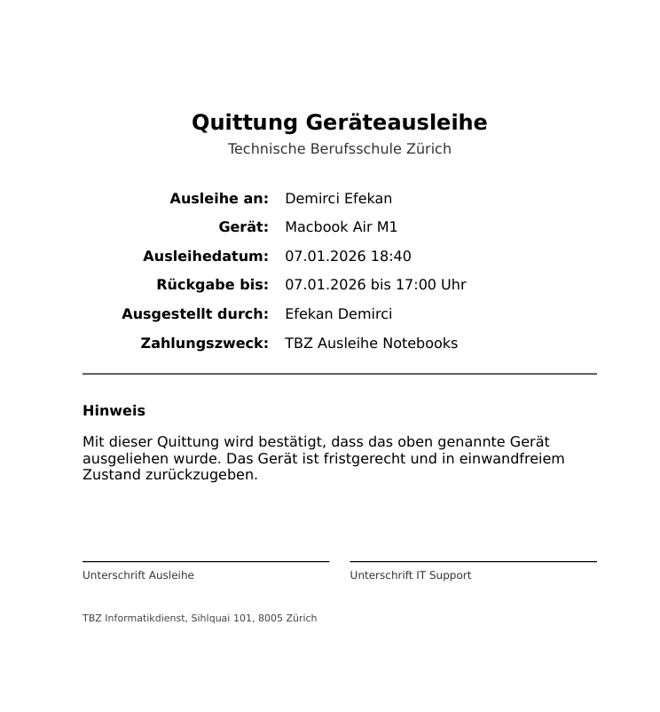

<small><em>Abbildung 45: PDF Generator Endpoint Test</em></small>

---

## CI: Build und Push nach GHCR

### Ziel

Das Image soll nur dann gebaut werden, wenn sich service oder Build Artefakte ändern. Zusätzlich soll das Image eindeutig versioniert werden, damit Rollback und Nachvollziehbarkeit möglich sind.

### Trigger Logik

Das Container Image wird nur gebaut, wenn sich Dateien ändern, die den Build Kontext beeinflussen.


* `Dockerfile`
* `service/**` (Applikationscode und Tests)
* Dependency Dateien im `service/` Kontext (zum Beispiel `requirements*.txt`, falls vorhanden)
* `.github/workflows/container-build.yml`

Änderungen an Kubernetes Manifesten unter `k3s/**` lösen keinen Container Build aus. Sie werden über den Deploy Workflow ausgerollt.


GHCR verlangt lowercase Repository Namen. Falls das Repository auf GitHub Grossbuchstaben enthält, muss der Image Tag vor dem Push in lowercase umgewandelt werden.


Container Build: 

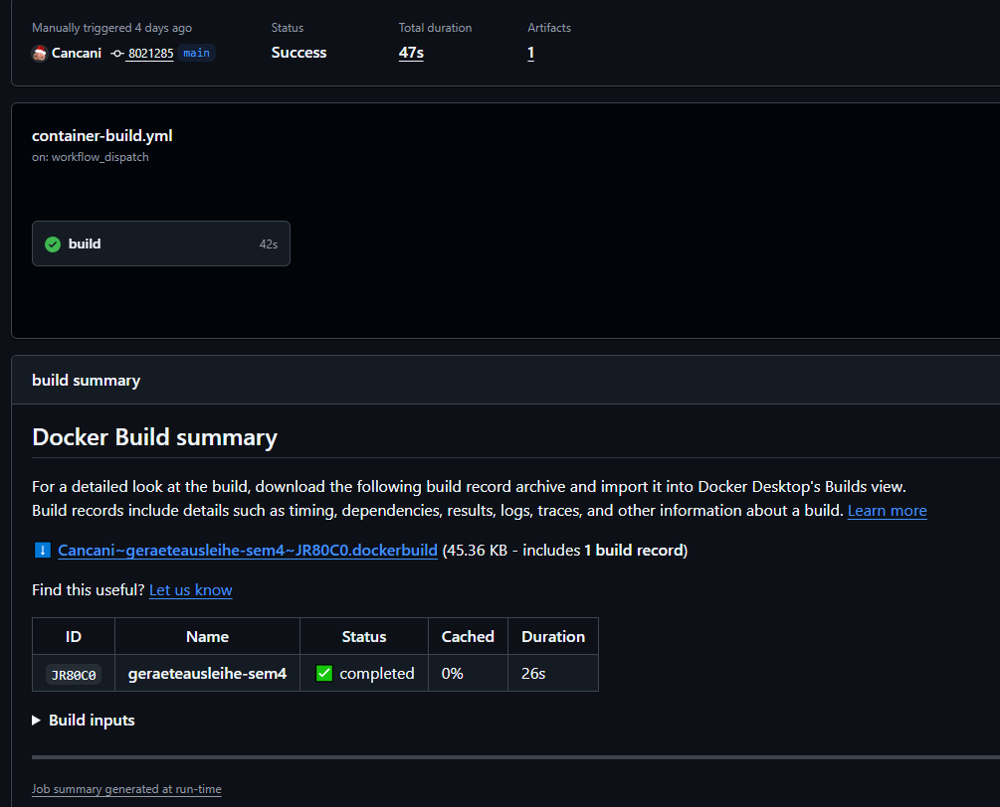

<small><em>Abbildung 46: Container Build</em></small>

Deploy auf EC2:


<small><em>Abbildung 47: K3s Cluster Status</em></small>

---

## Tagging Strategie

Es werden zwei Tags verwendet.

* latest als schneller Referenz Tag für den aktuellen Stand
* Commit SHA als deterministische Version, die exakt zu einem Commit passt

Beispiel.

```text
ghcr.io/cancani/geraeteausleihe-sem4:latest
ghcr.io/cancani/geraeteausleihe-sem4:<commit_sha>
```


<small><em>Abbildung 48: Tagging</em></small>

---

## CD: Deployment nach K3s auf AWS EC2

### Ordnerstruktur für Manifeste

Die Kubernetes Manifeste liegen im Repository im Ordner k3s.

* namespace.yaml
* deployment.yaml
* service.yaml
* ingress.yaml

### Deploy Ablauf

Der Deploy Workflow setzt die Umgebung in folgender Reihenfolge.

1. Kubernetes Manifeste auf die EC2 kopieren
2. namespace, deployment, service und ingress anwenden
3. Ingress Host auf den aktuellen nip.io Host setzen
4. Deployment Image auf den passenden Commit Tag setzen
5. Rollout prüfen

### Häufiger Fehler: InvalidImageName

Symptom.

* Pod Status InvalidImageName
* Deployment zeigt ein Image wie ghcr.io/:<sha>

Typische Ursache.

* Image String wurde aus einer leeren oder nicht verfügbaren Variable zusammengesetzt
* Das kann passieren, wenn Variablen im SSH Script nicht so verfügbar sind wie im GitHub Runner

Sofortmassnahme auf der EC2.

```bash
kubectl -n geraeteausleihe get deploy geraeteausleihe -o jsonpath='{.spec.template.spec.containers[0].name}{"\n"}{.spec.template.spec.containers[0].image}{"\n"}'

CN=$(kubectl -n geraeteausleihe get deploy geraeteausleihe -o jsonpath='{.spec.template.spec.containers[0].name}')
kubectl -n geraeteausleihe set image deployment/geraeteausleihe ${CN}=ghcr.io/cancani/geraeteausleihe-sem4:latest
kubectl -n geraeteausleihe rollout restart deployment/geraeteausleihe
kubectl -n geraeteausleihe rollout status deployment/geraeteausleihe --timeout=180s
```

Langfristige Lösung im Workflow.

* Image String im Workflow so zusammensetzen, dass er nicht leer sein kann
* Deploy SHA sauber setzen, je nach Trigger
  * workflow run nutzt head sha des Build Runs
  * workflow dispatch nutzt den aktuellen github sha

### Ingress Host Validierung

Ingress Hosts müssen RFC 1123 konform sein, also nur lowercase, Zahlen, Punkte und Bindestriche, und dürfen nicht mit einem Platzhalter wie CHANGE_ME deployed werden.

---

## Verifikation nach dem Deployment

### Kontrolle auf der EC2

```bash
kubectl -n geraeteausleihe get pods -o wide
kubectl -n geraeteausleihe get deploy
kubectl -n geraeteausleihe get ingress
kubectl -n geraeteausleihe get deploy geraeteausleihe -o jsonpath='{.spec.template.spec.containers[0].image}{"\n"}'
```

Screenshots:

---

## Betrieb

Dieses Kapitel beschreibt den minimalen Betrieb für das Single Node K3s Setup auf AWS EC2. Fokus ist ein reproduzierbarer Ablauf für Deployment, Verifikation, Rollback und Troubleshooting.

### Deployment Ablauf

1. Code Änderung wird in GitHub gepusht
2. Container Image wird gebaut und nach GHCR gepusht, nur bei Änderungen im Service Kontext
3. Deployment Workflow wendet die Manifeste aus `k3s/` auf der EC2 Instanz an
4. Deployment wird auf das neue Image aktualisiert

### Rollback Vorgehen

Ein Rollback ist möglich, falls ein Deployment fehlschlägt oder die Applikation nicht mehr korrekt reagiert.

1. Rollout Verlauf prüfen  
   `kubectl -n <namespace> rollout history deploy/<deployment-name>`
2. Rollback auf vorherige Revision ausführen  
   `kubectl -n <namespace> rollout undo deploy/<deployment-name>`
3. Status prüfen bis das Deployment wieder Available ist  
   `kubectl -n <namespace> rollout status deploy/<deployment-name>`
4. Funktionstest über Ingress URL durchführen und Logs kontrollieren

## Troubleshooting Checkliste

### Ingress und Routing

1. Ingress Ressource existiert  
   `kubectl -n <namespace> get ingress`
2. Hostname stimmt und zeigt auf die EC2 IP
3. Traefik sieht die Route und liefert keine 404 oder 502 Fehler

### Service und Endpoints

1. Service zeigt auf die korrekten Labels  
   `kubectl -n <namespace> describe svc <service-name>`
2. Endpoints sind vorhanden  
   `kubectl -n <namespace> get endpoints <service-name>`
3. Pods sind Ready, sonst wird kein Traffic geroutet

### Pod Fehler

1. Logs prüfen  
   `kubectl -n <namespace> logs <pod-name>`
2. Events prüfen  
   `kubectl -n <namespace> describe pod <pod-name>`
3. Ressourcen Hinweise prüfen, zum Beispiel OOMKilled oder Memory Pressure

### Registry und Image Pull

1. Image Name und Tag sind korrekt im Deployment gesetzt
2. Image ist in GHCR vorhanden
3. Bei ImagePullBackOff prüfen, ob Pull Rechte und Secret korrekt sind

## Wartung und Betriebshinweise

1. Basis Image und Dependencies regelmässig aktualisieren
2. GitHub Actions Workflows und verwendete Actions Versionen aktuell halten
3. Der Service ist stateless, daher liegt der Fokus auf reproduzierbarem Deploy und Versionierung  
   Für produktiven Betrieb sollten Secrets und Cluster State separat gesichert und verwaltet werden


## App-Demo

Das folgende .gif zeigt die Geräteausleihe und das erhalten einer Quittung durch die EC2-Instanz.

[Demo Geräteausleihe](./screenshots/Demo_Geraeteausleihe.gif)

<small><em>Abbildung 49: Demo der Geräteausleihe-Applikation mit PDF-Generierung</em></small>

---

## Fazit

### Projekterfolg

Das Ziel dieser Semesterarbeit war die Cloud Native Transformation des bestehenden Geräteausleihe Microservice. Der Service wurde containerisiert, automatisiert gebaut, in einer Container Registry versioniert und auf einem Kubernetes Cluster betrieben. Die externe Erreichbarkeit ist über Traefik Ingress und nip.io umgesetzt, inklusive der relevanten Endpunkte healthz und pdf. Der Betrieb wurde mit konkreten Verifikationen belegt, sowohl über Kubernetes Status als auch über externe Requests. 

Zusätzlich wurde die Dokumentation als zentrale Prüfbasis über GitHub Pages ausgebaut. Damit sind technische Nachweise, Architektur, Projektmanagement und Betrieb an einem Ort nachvollziehbar. Dieser Aspekt war entscheidend, damit der Projektstand nicht nur funktioniert, sondern für Dozenten und Stakeholder auch effizient überprüfbar ist. 

---

### Reflexion

Die grösste Erkenntnis aus der Umsetzung war, dass technische Funktion allein nicht genügt. Ein professioneller Cloud Engineering Output entsteht erst, wenn Technik, Nachweise und Projekttransparenz zusammenpassen. Genau diese Lücke wurde im Verlauf des Projekts sichtbar. Im Sprint Review Kontext wurde kritisiert, dass zeitweise Transparenz fehlte, zum Beispiel fehlender Überblick über Ziele und Herausforderungen, ein nicht zugängliches Board und uneinheitliche Sprintlängen. Diese Rückmeldungen wurden aufgenommen und konkret korrigiert, indem der Überblick in der Dokumentation verbessert, der Board Link aktualisiert und Sprint Ziele klarer formuliert wurden. 

Technisch war die Automatisierung der Deploy Schritte ein wiederkehrender Knackpunkt. Besonders deutlich wurde, wie schnell eine Pipeline fehlschlagen kann, wenn Variablen oder Image Tags nicht deterministisch gesetzt sind. Ein Beispiel dafür ist der Fehler InvalidImageName, der durch leere oder falsch zusammengesetzte Image Strings entstehen kann. Daraus habe ich gelernt, dass CI und CD nicht nur gebaut, sondern konsequent über Rollout Status, Logs und externe Health Checks verifiziert werden müssen. 

Methodisch hat sich die sprintbasierte Arbeitsweise als klarer Gewinn gezeigt. WIP Limit, Schätzungen und sichtbare Priorisierung erhöhen den Fokus und reduzieren Parallelität. Das Feedback von Corrado hat diesen Teil bestätigt und gleichzeitig klar gemacht, dass Prioritäten und Schätzungen für Dritte direkt auf den Board Karten sichtbar sein sollen, damit der Projektstand ohne Klicks verstanden wird. Diese Erkenntnis nehme ich als verbindlichen Standard für künftige Projekte mit.

---

### Technische Erkenntnisse

Im Projekt wurden zentrale Cloud Engineering Konzepte praktisch umgesetzt und vertieft.

1. Deklaratives Kubernetes Deployment  
   Der Betrieb erfolgt über versionierte Kubernetes Ressourcen wie Namespace, Deployment, Service und Ingress. Dadurch ist der Stand reproduzierbar und der Betrieb wird über die Plattform Eigenschaften wie Rolling Update und Self Healing unterstützt. Readiness und Liveness basieren auf dem healthz Endpunkt. 

2. CI und CD mit sauberer Trigger Logik  
   Der Container Build wird nur ausgelöst, wenn sich der Build Kontext ändert, zum Beispiel Dockerfile oder Service Code. Änderungen an Kubernetes Manifesten lösen keinen Build aus und werden über den Deploy Prozess ausgerollt. Das reduziert unnötige Builds und hält den Prozess effizient. 

3. Versionierung und Nachvollziehbarkeit über Tags  
   Die Tagging Strategie mit latest und Commit SHA sorgt dafür, dass jede ausgelieferte Version eindeutig einem Stand zugeordnet werden kann. Das ist die Basis für reproduzierbare Releases und Rollback Fähigkeit. 

4. Betrieb und Fehlersuche als Runbook Denkweise  
   Neben der reinen Umsetzung wurde Betrieb dokumentiert, inklusive Rollback Vorgehen und Troubleshooting Checkliste für Ingress, Service Endpoints, Pod Fehler sowie Registry Pull Probleme. Dadurch ist das System nicht nur lauffähig, sondern auch betreibbar. 

5. Security als bewusste Abgrenzung zwischen Demo und Produktion  
   Security Group Regeln und grundlegende Host Massnahmen sind dokumentiert. Gleichzeitig ist klar beschrieben, welche Themen bewusst nicht umgesetzt wurden, zum Beispiel TLS, umfassendes Cluster Hardening und erweitertes Secrets Management, und was in einer produktiven Umgebung erforderlich wäre. 

6. Observability pragmatisch und nachvollziehbar  
   Observability wurde bewusst schlank gehalten und basiert auf Kubernetes Standardmitteln wie Logs und Events. Ein zentrales Monitoring ist nicht Teil des Demo Setups, wird aber als sinnvoller Ausbaupunkt für Produktion benannt. 

---

### Ausblick

Der aktuelle Stand eignet sich als stabile Lern und Demo Umgebung und kann gezielt weiter professionalisiert werden.

1. Projekttransparenz weiter erhöhen  
   Burndown Darstellung prüfen und wenn möglich ergänzen. Priorität und Story Points sollen direkt auf den Karten sichtbar sein, danach Screenshot in die Dokumentation.

2. Evidence schneller erfassbar machen  
   Eine sehr kurze Demo als GIF in die Dokumentation integrieren, damit der Effekt sofort sichtbar ist. Relevante Personen im Review Kontext sollen dabei explizit markiert werden.

3. Risikomanagement weiterentwickeln  
   Die Risikomatrix wird laufend gepflegt. Zusätzlich kann die Risiko Entwicklung über Zeit visualisiert werden, damit Trends sichtbar sind und Massnahmen messbar werden. 

4. Technische Härtung und Produktiv Betrieb vorbereiten  
   TLS Einbindung mit cert manager und einem gültigen DNS Setup, ergänzende Cluster Schutzmassnahmen wie Pod Security und Network Policies sowie ein zentrales Monitoring mit Prometheus und Grafana.

5. Nutzen im TBZ Kontext prüfen  
   Mit der Fachstelle klären, ob das Ergebnis langfristig eingesetzt werden kann, damit die investierte Entwicklungszeit nachhaltig verwertet wird.


---

## Abbildungsverzeichnis

| Nr. | Abbildung | Kapitel | Typ |
|-----|-----------|---------|-----|
| 1 | Ist-Workflow mit manuellen Build- und Deployment-Schritten | Ist Zustand | Mermaid Flowchart |
| 2 | Soll-Workflow mit automatisiertem CI/CD-Prozess über GitHub Actions und AWS | Soll Zustand | Mermaid Flowchart |
| 3 | Sprint-Übersicht im GitHub Project Board | Projektphasen und Meilensteine | Screenshot |
| 4 | Priorisierung im GitHub Project Board | Priorisierung | Screenshot |
| 5 | Sprint 1 Meilensteine und Issues | Sprint 1 Planung, Review und Retrospektive | Screenshot |
| 6 | Abgeschlossene Tasks in Sprint 1 | Sprint 1 Review | Screenshot |
| 7 | GitHub Project Board Ansicht für Sprint 1 | Sprint 1 Review | Screenshot |
| 8 | Issue-Labels zur Kategorisierung | Sprint 1 Review | Screenshot |
| 9 | Meilenstein-Übersicht im Projekt | Sprint 1 Review | Screenshot |
| 10 | Issue-Template für strukturierte Erfassung | Sprint 1 Review | Screenshot |
| 11 | Issue-Template für strukturierte Erfassung | Sprint 1 Review | Screenshot |
| 12 | Starfish Retrospektive Sprint 1 | Sprint 1 Retrospektive | Screenshot |
| 13 | Sprint 2 Meilensteine und Issues | Sprint 2 Planung | Screenshot |
| 14 | Abgeschlossene Tasks in Sprint 2 | Sprint 2 Review | Screenshot |
| 15 | Starfish Retrospektive Sprint 2 | Sprint 2 Retrospektive | Screenshot |
| 16 | Sprint 3 Meilensteine und Issues | Sprint 3 Planung | Screenshot |
| 17 | Sprint 3 Meilensteine und Issues | Sprint 3 Review | Screenshot |
| 18 | Starfish Retrospektive Sprint 3 | Sprint 3 Retrospektive | Screenshot |
| 19 | GitHub Project Board Gesamtansicht | Verwaltung der Aufgaben | Screenshot |
| 20 | SWOT-Analyse für Projektstrategie | SWOT-Analyse | Screenshot |
| 21 | Use-Case-Diagramm der Systeminteraktionen | Use-Case Diagramm | Screenshot |
| 22 | Risikomatrix mit identifizierten Projektrisiken | Risikomatrix | Screenshot |
| 23 | Sequenzdiagramm des Sprint-Zyklus | Deployment Ablauf | Mermaid Sequence |
| 24 | Soll-Workflow mit automatisiertem CI/CD-Prozess über GitHub Actions und AWS | Flowchart LR Komponenten und Datenfluss von Entwic... | Mermaid Flowchart |
| 25 | Prozessdiagramm | Flowchart TB interne Kubernetes Struktur im Cluste... | Mermaid Flowchart |
| 26 | Soll-Workflow mit automatisiertem CI/CD-Prozess über GitHub Actions und AWS | Zielbild | Mermaid Flowchart |
| 27 | Curl Commands Endpoints | Schnittstellen und Endpunkte | Screenshot |
| 28 | GET / Lokal | GET / | Screenshot |
| 29 | Health Check Endpoint Verifikation | GET /healthz | Screenshot |
| 30 | PDF Generator Endpoint Test | GET /pdf | Screenshot |
| 31 | Unit Tests mit Pytest | Testausführung im Container | Screenshot |
| 32 | Docker Container Verifikation | Lokaler Build und Run | Screenshot |
| 33 | Verifikation Container | Lokaler Build und Run | Screenshot |
| 34 | GitHub Container Registry Tags | Naming und Tagging | Screenshot |
| 35 | K3s Cluster Status | K3s Installation | Screenshot |
| 36 | kubectl Kommandozeilenausgabe | K3s Installation | Screenshot |
| 37 | Kubernetes Deployment Konfiguration | Deployment | Screenshot |
| 38 | Kubernetes Service Konfiguration | Service | Screenshot |
| 39 | Kubernetes Ingress Routing | Ingress | Screenshot |
| 40 | Workflows | Workflow Übersicht | Screenshot |
| 41 | GitHub Secrets Konfiguration | Benötigte Secrets | Screenshot |
| 42 | Kubernetes Status | Kubernetes Status | Screenshot |
| 43 | Externe Requests | Externe Requests | Screenshot |
| 44 | PDF Generator Endpoint Test | Launch auf PDF Endpoint | Screenshot |
| 45 | PDF Generator Endpoint Test | Launch auf PDF Endpoint | Screenshot |
| 46 | Container Build | Trigger Logik | Screenshot |
| 47 | K3s Cluster Status | Trigger Logik | Screenshot |
| 48 | Tagging | Tagging Strategie | Screenshot |
| 49 | Demo der Geräteausleihe-Applikation mit PDF-Generierung | App-Demo | GIF |

## Legende

**Dateitypen:**
- **PNG**: Statische Screenshots und Grafiken
- **Mermaid**: Interaktive Diagramme (Flowcharts, Sequenzdiagramme, Graphen)
- **MP4 / GIF**: Kurze Demo- oder End-to-End-Demonstrationen des Systems

**Mermaid Diagramme im Detail:**
- **Flowchart**: Prozessabläufe und Workflows
- **Graph TB/LR**: Systemarchitektur und Use-Cases
- **Sequence**: Datenfluss und API-Kommunikation

**Pfad-Referenzen:**
Alle Medien befinden sich im Verzeichnis `./screenshots/` relativ zur Dokumentation

## Glossar

| Begriff | Erklärung |
|--------|-----------|
| AWS | Amazon Web Services, Cloud Plattform für Infrastruktur |
| EC2 | Virtuelle Server Instanz innerhalb von AWS |
| K3s | Leichtgewichtige Kubernetes Distribution |
| Kubernetes | Plattform zur Orchestrierung von Containern |
| Pod | Kleinste ausführbare Einheit in Kubernetes |
| Deployment | Kubernetes Ressource für Rollout und Skalierung |
| Service | Kubernetes Ressource zur internen Netzwerkfreigabe |
| Ingress | Kubernetes Ressource für externen Zugriff auf Services |
| Traefik | Ingress Controller für Kubernetes |
| nip.io | DNS Dienst zur Nutzung von IP basierten Hostnamen |
| Container | Isolierte Laufzeitumgebung für Anwendungen |
| Docker | Tool zur Erstellung und Ausführung von Containern |
| CI/CD | Automatisierter Prozess für Build und Deployment |
| GitHub Actions | CI/CD Plattform innerhalb von GitHub |
| GHCR | GitHub Container Registry für Container Images |
| Image | Gebautes Container Artefakt |
| Rollout | Ausrollen einer neuen Version |
| Rollback | Zurücksetzen auf eine vorherige Version |
| Health Check | Technische Prüfung der Service Verfügbarkeit |
| Microservice | Eigenständiger, containerisierter Backend Service |
| Observability | Sammelbegriff für Logs, Status und Überwachung |
| Stateless | Anwendung ohne persistenten Zustand |
| YAML | Konfigurationsformat für Kubernetes Manifeste |

# Kontakt

Für Rückfragen oder weiterführende Informationen zu diesem Projekt:

**Efekan Demirci**  
Technische Berufsschule Zürich (TBZ)  
Informatikdienst  
efekan@demirci.ch

Die Projektdokumentation ist **öffentlich zugänglich**.

