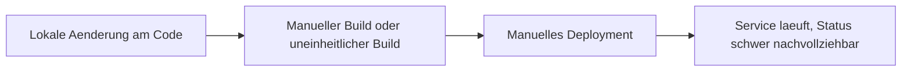
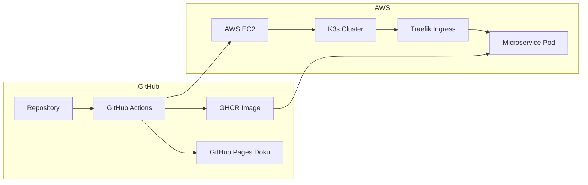

# 1 Projektdefinition

## 1.1 Einreichungsformular

Das Einreichungsformular kann hier entnommen werden:  
[ITCNE24 Semesterarbeit 4 Einreichungsformular](./Efekan_Einreichungsformular_4.SemesterV2.docx)

---

## 1.2 Projektuebersicht

| Eigenschaft | Details |
|---|---|
| **Titel** | Geraeteausleihe Microservice, Cloud Native Deployment auf AWS |
| **Studierender** | Efekan Demirci |
| **Dozenten** | PRJ Corrado Parisi, MSVC Philip Stark |
| **Semester** | 4 Semester HF TBZ, ITCNE24 |
| **Zeitraum** | Oktober 2025 bis Januar 2026 |
| **Technologie Stack** | Python Flask, Docker, K3s auf AWS EC2, GitHub Actions, GHCR, MkDocs |
| **Architektur** | Microservice, Container, Kubernetes Deployment, Ingress Routing |
| **Repository** | https://github.com/Cancani/geraeteausleihe-sem4 |
| **GitHub Pages** | https://cancani.com/geraeteausleihe-sem4/ |
| **Project Board** | https://github.com/users/Cancani/projects/3/views/1 |

Die bestehende Geräteausleihe Lösung aus der vorherigen Semesterarbeit dient als Ausgangsbasis. In dieser Arbeit steht nicht die fachliche Erweiterung im Vordergrund, sondern die Cloud Native Transformation: Containerisierung, automatisierte Build und Deploy Pipelines sowie der Betrieb in einem Kubernetes Cluster auf AWS.

**Key Features**
* Container Build und Push nach GHCR
* Automatisiertes Deployment nach K3s auf AWS EC2 via GitHub Actions
* Ingress Routing ueber Traefik und Hostname ueber nip.io
* Extern erreichbare Endpoints healthz und pdf
* Laufende Dokumentation ueber MkDocs und GitHub Pages

---

## 1.3 Ausgangslage und Problemstellung

### 1.3.1 Ist Zustand

Der Service war zwar technisch lauffähig, der Betrieb und das Deployment waren jedoch zu wenig standardisiert und zu wenig automatisiert. Zudem fehlten laufende Nachweise und eine klare Transparenz über Projektstand, Risiken und Fortschritt.

Typische Nachteile im Ist Zustand:
* Deployment Updates waren fehleranfällig und schwer nachvollziehbar
* Kein konsistentes Release und Tagging Konzept
* Keine Kubernetes Eigenschaften wie Self Healing und deklarative Deployments
* Nachweise für Stakeholder fehlten oder wurden erst spät nachgetragen

**Ist Workflow**

---

### 1.3.2 Soll Zustand

Ziel ist ein durchgängig automatisierter Workflow vom Commit bis zum laufenden Pod im Cluster. Jede relevante Änderung soll ein Image bauen, in die Registry pushen und anschliessend automatisiert im K3s Cluster deployed werden. Der Betriebszustand soll jederzeit über Board, Doku und konkrete Nachweise nachvollziehbar sein.

**Soll Workflow**

**Soll Verbesserungen**

| Verbesserung | Nutzen | Umsetzung |
|---|---|---|
| Automatisierter Build und Push | Reproduzierbar, nachvollziehbar | GitHub Actions, GHCR |
| Automatisierter Deploy | Schneller und konsistent | GitHub Actions, kubectl apply |
| Deklarative Kubernetes Manifeste | Standardisiertes Deployment | Namespace, Deployment, Service, Ingress |
| Laufende Nachweise | Transparenz für Stakeholder | Screenshots, Links, Sprint Reviews |

---

## 1.4 Zielsetzung

Die Arbeit hat das Ziel, den bestehenden Microservice in eine Cloud Native Betriebsumgebung zu überfuehren. Der Fokus liegt auf CI und CD, Kubernetes Deployment, stabiler Erreichbarkeit ueber Ingress sowie einer laufenden Dokumentation, die den Fortschritt und die Qualität belegt.

---

### 1.4.1 SMART Ziele

| Ziel | Spezifisch | Messbar | Attraktiv | Realistisch | Terminiert |
|---|---|---|---|---|---|
| CI Build und Push | Container Image wird gebaut und nach GHCR gepusht | Erfolgreiche Actions Runs und sichtbare Tags | DevOps Nutzen | Mit GitHub Actions umsetzbar | Sprint 2 und 3 |
| CD Deploy nach K3s | Manifeste werden applied und Image wird aktualisiert | Pods laufen, Service extern erreichbar | Automatisierung | Mit K3s auf EC2 umsetzbar | Sprint 2 und 3 |
| Ingress und Endpoints | Health und PDF funktionieren extern | HTTP 200, PDF Response | Demo faehig | Traefik und nip.io vorhanden | Sprint 2 |
| Dokumentation und Nachweise | Laufende Sprint Reviews mit Belegen | Pro Sprint Belegliste mit Screenshots | Stakeholder Transparenz | Mit MkDocs umsetzbar | Laufend |

---

## 1.5 Technologien und Werkzeuge

| Bereich | Technologie | Begruendung |
|---|---|---|
| Backend | Python Flask | Schlankes Framework für Microservices |
| Containerisierung | Docker | Portabilität und reproduzierbarer Betrieb |
| Orchestrierung | K3s | Kubernetes Betrieb auf einer EC2 Instanz |
| Cloud Hosting | AWS EC2 | Realistische Zielumgebung für DevOps Deployment |
| Registry | GHCR | In GitHub integriert, einfache Distribution |
| CI und CD | GitHub Actions | Automatisierung von Build, Push und Deploy |
| Ingress | Traefik | Routing im Cluster und externe Erreichbarkeit |
| Dokumentation | MkDocs, GitHub Pages | Versionierte und laufend publizierte Doku |
| Projektmanagement | GitHub Projects, Issues | Backlog, Schätzungen, Priorisierung, DoD |

