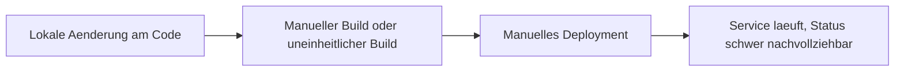
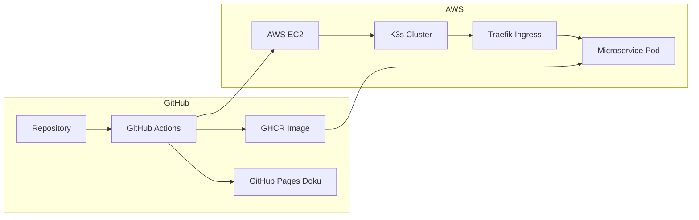

# 1 Projektdefinition

## 1.1 Einreichungsformular

Das Einreichungsformular kann hier entnommen werden:  
[ITCNE24 Semesterarbeit 4 Einreichungsformular](./Efekan_Einreichungsformular_4.SemesterV2.docx)

---

## 1.2 Projektübersicht

| Eigenschaft | Details |
|---|---|
| **Titel** | Geraeteausleihe Microservice, Cloud Native Deployment auf AWS |
| **Studierender** | Efekan Demirci |
| **Dozenten** | PRJ Corrado Parisi, MSVC Philip Stark |
| **Semester** | 4 Semester HF TBZ, ITCNE24 |
| **Zeitraum** | Oktober 2025 bis Januar 2026 |
| **Technologie Stack** | Python Flask, Docker, K3s auf AWS EC2, GitHub Actions, GHCR, MkDocs |
| **Architektur** | Microservice, Container, Kubernetes Deployment, Ingress Routing |
| **Repository** | https://github.com/Cancani/geraeteausleihe-sem4 |
| **GitHub Pages** | https://cancani.com/geraeteausleihe-sem4/ |
| **Project Board** | https://github.com/users/Cancani/projects/3/views/1 |

Die bestehende Geräteausleihe Lösung aus der vorherigen Semesterarbeit dient als Ausgangsbasis. In dieser Arbeit steht nicht die fachliche Erweiterung im Vordergrund, sondern die Cloud Native Transformation: Containerisierung, automatisierte Build und Deploy Pipelines sowie der Betrieb in einem Kubernetes Cluster auf AWS.

**Key Features**
* Container Build und Push nach GHCR
* Automatisiertes Deployment nach K3s auf AWS EC2 via GitHub Actions
* Ingress Routing ueber Traefik und Hostname ueber nip.io
* Extern erreichbare Endpoints healthz und pdf
* Laufende Dokumentation ueber MkDocs und GitHub Pages

---

## 1.3 Ausgangslage und Problemstellung

### 1.3.1 Ist Zustand

Der Service war zwar technisch lauffähig, der Betrieb und das Deployment waren jedoch zu wenig standardisiert und zu wenig automatisiert. Zudem fehlten laufende Nachweise und eine klare Transparenz über Projektstand, Risiken und Fortschritt.

Typische Nachteile im Ist Zustand:
* Deployment Updates waren fehleranfällig und schwer nachvollziehbar
* Kein konsistentes Release und Tagging Konzept
* Keine Kubernetes Eigenschaften wie Self Healing und deklarative Deployments
* Nachweise für Stakeholder fehlten oder wurden erst spät nachgetragen

**Ist Workflow**

---

### 1.3.2 Soll Zustand

Ziel ist ein durchgängig automatisierter Workflow vom Commit bis zum laufenden Pod im Cluster. Jede relevante Änderung soll ein Image bauen, in die Registry pushen und anschliessend automatisiert im K3s Cluster deployed werden. Der Betriebszustand soll jederzeit über Board, Doku und konkrete Nachweise nachvollziehbar sein.

**Soll Workflow**

**Soll Verbesserungen**

| Verbesserung | Nutzen | Umsetzung |
|---|---|---|
| Automatisierter Build und Push | Reproduzierbar, nachvollziehbar | GitHub Actions, GHCR |
| Automatisierter Deploy | Schneller und konsistent | GitHub Actions, kubectl apply |
| Deklarative Kubernetes Manifeste | Standardisiertes Deployment | Namespace, Deployment, Service, Ingress |
| Laufende Nachweise | Transparenz für Stakeholder | Screenshots, Links, Sprint Reviews |

---

## 1.4 Zielsetzung

Die Arbeit hat das Ziel, den bestehenden Microservice in eine Cloud Native Betriebsumgebung zu überfuehren. Der Fokus liegt auf CI und CD, Kubernetes Deployment, stabiler Erreichbarkeit ueber Ingress sowie einer laufenden Dokumentation, die den Fortschritt und die Qualität belegt.

---

### 1.4.1 SMART Ziele

| Ziel | Spezifisch | Messbar | Attraktiv | Realistisch | Terminiert |
|---|---|---|---|---|---|
| CI Build und Push | Container Image wird gebaut und nach GHCR gepusht | Erfolgreiche Actions Runs und sichtbare Tags | DevOps Nutzen | Mit GitHub Actions umsetzbar | Sprint 2 und 3 |
| CD Deploy nach K3s | Manifeste werden applied und Image wird aktualisiert | Pods laufen, Service extern erreichbar | Automatisierung | Mit K3s auf EC2 umsetzbar | Sprint 2 und 3 |
| Ingress und Endpoints | Health und PDF funktionieren extern | HTTP 200, PDF Response | Demo faehig | Traefik und nip.io vorhanden | Sprint 2 |
| Dokumentation und Nachweise | Laufende Sprint Reviews mit Belegen | Pro Sprint Belegliste mit Screenshots | Stakeholder Transparenz | Mit MkDocs umsetzbar | Laufend |

---

## 1.5 Technologien und Werkzeuge

| Bereich | Technologie | Begründung |
|---|---|---|
| Backend | Python Flask | Schlankes Framework für Microservices |
| Containerisierung | Docker | Portabilität und reproduzierbarer Betrieb |
| Orchestrierung | K3s | Kubernetes Betrieb auf einer EC2 Instanz |
| Cloud Hosting | AWS EC2 | Realistische Zielumgebung für DevOps Deployment |
| Registry | GHCR | In GitHub integriert, einfache Distribution |
| CI und CD | GitHub Actions | Automatisierung von Build, Push und Deploy |
| Ingress | Traefik | Routing im Cluster und externe Erreichbarkeit |
| Dokumentation | MkDocs, GitHub Pages | Versionierte und laufend publizierte Doku |
| Projektmanagement | GitHub Projects, Issues | Backlog, Schätzungen, Priorisierung, DoD |

# 2 Projektmanagement

## 2.1 Projektmethodik

Das Projekt folgt einem agilen, scrumähnlichen Vorgehen mit iterativer Entwicklung und regelmässigen Review Zyklen. Die Planung und Nachverfolgung erfolgt vollständig in GitHub.

**Gewählte Methodik: Sprint basierte Entwicklung**

Die Entscheidung für ein iteratives Vorgehen basiert auf folgenden Punkten:

* Neue technische Themen wie Kubernetes, K3s und CI CD benötigen experimentelles Vorgehen mit kurzen Feedback Schleifen
* Technische Abhängigkeiten werden oft erst während der Umsetzung sichtbar, zum Beispiel Ingress, Host Routing und Secrets Handling
* Dozenten Feedback kann direkt in die nächsten Tasks und in die Dokumentation einfliessen
* Risiken werden früh sichtbar, statt erst am Schluss

**Kernprinzipien der angewandten Methodik**

* Iterative Entwicklung mit funktionsfähigen Zwischenständen
* Kontinuierliches Feedback und Anpassung der Prioritäten
* Laufende Nachweisführung, damit der Projektstand jederzeit nachvollziehbar ist
* Klare Definition of Done pro Ticket inklusive Evidence Anforderungen

### 2.1.1 Sprintstruktur im Detail

**Sprint Planning (Sprintbeginn):**
* Definition von User Stories mit klaren Akzeptanzkriterien
* Aufwandsschätzung in Story Points und Priorisierung nach Must Should Could
* Festlegung des Sprintziels als ein Satz Outcome und der Deliverables
* Sprint Scope im GitHub Project Board zuweisen, Sprint Feld und Milestone setzen

**Sprint Execution (Durchführung):**
* Kontinuierliche Arbeit an den definierten User Stories
* GitHub Issues für Aufgaben Tracking und Statusupdates
* Regelmässige Commits und Pushes, kleine Änderungen statt grosse Sprünge
* Ticket Status aktuell halten, WIP Limit in Progress maximal 2

**Sprint Review (Sprintende):**
* Demo der implementierten Features und Abgleich gegen Sprintziel
* Review Gespräche mit Dozenten zur Qualitätssicherung
* Bewertung der Zielerreichung und Identifikation von Verbesserungspotenzialen
* Evidence Pflicht, Screenshots und Links werden direkt pro Sprint Review dokumentiert

**Sprint Retrospektive:**
* Reflexion des Arbeitsprozesses mit dem Starfish Modell
* Identifikation von Start Doing, Stop Doing, Keep Doing, More Of, Less Of
* Konkrete Action Items als Issues erfassen und dem nächsten Sprint zuordnen

**Vorteile der gewählten Methodik:**
* Flexibilität, schnelle Anpassung an neue Erkenntnisse, zum Beispiel Ingress Routing oder CI CD Details
* Qualitätssicherung, regelmässige Reviews verhindern späte Richtungsänderungen
* Motivation, sichtbare Fortschritte nach jedem Sprint
* Lernoptimierung, Retrospektiven führen zu kontinuierlicher Prozessverbesserung

## 2.2 Projektphasen und Meilensteine

Das Projekt ist in drei Sprints gegliedert. Die Sprintzeiträume entsprechen der ursprünglichen Planung. Inhalte aus Sprint 1 und Sprint 2 wurden in einem späteren Zeitraum konzentriert nachgezogen. Die Dokumentation wird nun strukturiert und evidenzbasiert ergänzt, damit der Stand jederzeit nachvollziehbar ist.

### 2.2.1 Sprint Progression im Überblick

**Sprint 1 Projektbasis:**  
Aufbau der Projektbasis mit Board Struktur, Labels, Milestones, Issue Standards und erstem Architektur Zielbild.

**Sprint 2 Cluster und Deploy:**  
Aufbau der Laufzeitumgebung auf AWS EC2 mit K3s, Kubernetes Ressourcen und Ingress über Traefik. Erste externe Tests der Endpoints.

**Sprint 3 CI CD und Nachweise:**  
Stabilisierung von Build und Deploy Workflows mit GitHub Actions, saubere Versionierung, Rollback Vorgehen und laufende Nachweise pro Sprint.

### 2.2.2 Zeitplan

| Sprint       | Zeitraum                  | Fokus                                                                                      | Status        |
| ------------ | ------------------------- | ------------------------------------------------------------------------------------------ | ------------- |
| **Sprint 1** | 27.10.2025 bis 17.11.2025 | Projektbasis, Board Setup, Standards, Architektur Zielbild                                 | Abgeschlossen |
| **Sprint 2** | 18.11.2025 bis 15.12.2025 | AWS EC2 und K3s Setup, Kubernetes Manifeste, Ingress, erste externe Tests                  | Abgeschlossen |
| **Sprint 3** | 16.12.2025 bis 13.01.2026 | CI CD stabilisieren, Evidence pro Sprint, Dokumentation Finalisierung, Abgabe Vorbereitung | In Arbeit     |

---

## 2.3 Anpassung der Sprint Planung

In der praktischen Umsetzung wurden zentrale Inhalte aus Sprint 1 und Sprint 2 in einem späteren Zeitraum konzentriert nachgezogen. Gründe dafür waren parallele Verpflichtungen und die Priorisierung des technischen Fortschritts vor der finalen Dokumentationsform.

Die Sanierung erfolgt durch folgende Massnahmen:

* Backlog wird konsequent priorisiert und geschätzt
* Definition of Done wird strikt eingehalten, closed Tickets werden bei offenen DoD Punkten wieder geöffnet
* Sprint Reviews enthalten ab jetzt konkrete Nachweise, nicht nur Text
* Status Updates erfolgen regelmässig, inklusive Links auf Board und Dokumentation

---

## 2.4 Issues und User Stories

Das Projekt umfasst 27 User Stories, US01 bis US27. Alle Stories werden als GitHub Issues geführt und im [GitHub Project Board](https://github.com/users/Cancani/projects/3) verwaltet.

**Standards pro Issue**

* User Story Text
* Akzeptanzkriterien als Checkboxen
* Definition of Done als Checkboxen
* Labels für Priorität und Bereich
* Milestone Zuordnung zu Sprint

**Project Board Felder**

Die Steuerung erfolgt über folgende Felder im GitHub Project:

| Feld | Zweck |
|---|---|
| Status | Backlog, Ready, In Progress, Review, Done |
| Story Points | Aufwandsschätzung |
| Priorität | Must, Should, Could |
| Sprint | Sprint 1, Sprint 2, Sprint 3 |
| DoD erfüllt | Ja, Nein |

**Board Workflow**

| Spalte | Bedeutung |
|---|---|
| Backlog | Neue Anforderungen, noch nicht priorisiert |
| Ready | Priorisiert und bereit zur Umsetzung |
| In Progress | Aktive Umsetzung, WIP Limit beachten |
| Review | DoD Kontrolle, Evidence prüfen |
| Done | Abgeschlossen und dokumentiert |

---

## 2.5 Sprint 1 Planung und Sprint Review

### 2.5.1 Sprint 1 Planung

**Sprint Zeitraum**

27.10.2025 bis 17.11.2025

**Sprint Goal**

Projektbasis schaffen, damit Fortschritt und Qualität transparent nachvollziehbar sind. Fokus liegt auf Board Setup, Standards und erstem Architektur Zielbild.

**Sprint 1 Scope**

Die folgenden User Stories gehören zu Sprint 1:

| US | Titel | Bereich |
|---|---|---|
| US01 | Kanban Board finalisieren | Projektmanagement |
| US02 | Labels anlegen | Projektmanagement |
| US03 | Milestones anlegen | Projektmanagement |
| US04 | Issue Template einrichten | Projektmanagement |
| US05 | Branching Strategie dokumentieren | Dokumentation |
| US06 | Sprint 1 Review und Retro dokumentieren | Dokumentation |
| US07 | Architektur Zielbild skizzieren | Architektur |

**WIP Regel**

In Progress maximal 2 parallel laufende Issues.

**Evidence Standard für Sprint 1**

Für Sprint 1 werden mindestens folgende Nachweise geplant:

* Screenshot Project Board Übersicht
* Screenshot Labels
* Screenshot Milestones
* Screenshot Issue Template
* Link zur Branching Dokumentation
* Architektur Zielbild als Diagramm

---

### 2.5.2 Sprint 1 Review

**Review Ergebnis**

Sprint 1 wurde umgesetzt. Die Projektbasis ist vorhanden und bildet die Grundlage für Sprint 2 und Sprint 3.

| Review Punkt | Ergebnis |
|---|---|
| Board Struktur vorhanden und nachvollziehbar | Erfüllt |
| Labels vorhanden und konsistent genutzt | Erfüllt |
| Milestones für Sprints vorhanden | Erfüllt |
| Issue Template mit Akzeptanzkriterien und DoD vorhanden | Erfüllt |
| Branching Strategie dokumentiert | Erfüllt |
| Architektur Zielbild skizziert | Erfüllt |

### Nachweise und Belege

#### Board und Planung
* Project Board Overview  
  

* Labels  
  

* Milestones  
  

#### Standards
* Issue Template  
  
  

* Branching Strategie Dokumentation  
  Link: 

#### Architektur

Link:

## 2.6 Verwaltung der Aufgaben

Die Aufgaben wurden vollständig in [GitHub Projects](https://github.com/users/Cancani/projects/3/views/1) organisiert.  
Das Board ist nach Sprints gegliedert und orientiert sich an der Kanban-Struktur mit den Spalten  
**Backlog**, **Ready**, **In Progress**, **Review** und **Done**.  

Jede Aufgabe ist als **GitHub Issue** (US01 – US27) angelegt und enthält:
- eine klare **User Story**,
- **Akzeptanzkriterien** und **Definition of Done** als Checkboxen,
- eine **Priorität** (Must / Should / Could),
- die Zuordnung zum **Sprint** als Milestone

Der Fortschritt ist über das Board jederzeit nachvollziehbar:  
Geschlossene Issues wandern automatisch nach „Done“, offene bleiben in „Review“, bis alle DoD-Kriterien erfüllt und Nachweise in der Dokumentation ergänzt sind.  
Diese Struktur sorgt für durchgängige Transparenz im gesamten Projektmanagementprozess.

---

## 2.7 Wechsel von Microsoft Planner zu GitHub Projects und Issues

### 2.7.1 Hintergrund

Zu Beginn der Semesterarbeit 4 wurde die Projektplanung zunächst provisorisch in Microsoft Planner vorbereitet, da das Tool visuell bekannt war und bereits in früheren Arbeiten genutzt wurde.  
Mit dem Start der technischen Umsetzung erfolgte jedoch der Umstieg auf **GitHub Projects**, um Code, Doku und Aufgabenverwaltung auf einer Plattform zu bündeln.  

Durch diesen Wechsel konnten alle User Stories direkt mit Commits, Pull Requests und Actions-Runs verknüpft werden.  
Damit war es erstmals möglich, Planung, Automatisierung und Deployment vollständig integriert zu führen.

Der Entscheid wurde im Sprint-Review mit Corrado Parisi und Philip Stark besprochen und als Best Practice für Cloud-Native Projekte bestätigt.

---

### 2.7.2 Gründe für den Wechsel

- **Zentrale Plattform:** Code, Doku und Tasks an einem Ort  
- **Nachvollziehbarkeit:** Verknüpfung von Issues, Commits und Deployments  
- **Automatisierung:** Actions können Status oder Nachweise direkt aktualisieren  
- **Klarer Prozess:** Backlog → Sprint → Review → Done (identisch mit Planner, aber nachvollziehbar versioniert)  
- **GitHub Labels und Milestones:** Ersetzen Buckets und Fälligkeitsdaten aus Planner  
- **Synchronität mit CI/CD:** Automatische Workflows binden den Projektfortschritt direkt an den technischen Build Prozess  

Verwendete Labels:
- `sprint-1`, `sprint-2`, `sprint-3`
- `ci-cd`, `kubernetes`, `documentation`, `review`, `done`

---

### 2.7.3 Fazit

Der Wechsel zu GitHub Projects und Issues hat sich als entscheidender Schritt erwiesen.  
Er ermöglicht einen durchgängigen Arbeitsfluss zwischen Code, Automation und Projektmanagement, ohne Tool-Brüche.  
Zudem ist die Nachweisführung durch Screenshots, Actions-Runs und verlinkte Dokumentation klar prüfbar und Versionen lassen sich über Commit-SHAs direkt nachvollziehen.

## 2.8 SWOT-Analyse

Die SWOT-Analyse fasst die internen und externen Faktoren des Projekts zusammen und dient zur Bewertung der technologischen Tragfähigkeit und prozessualen Stabilität. Die SWOT-Analyse bietet einen strukturierten Überblick über die internen Stärken und Schwächen sowie die externen Chancen und Risiken des Projekts. Ziel ist es, das Projekt im Hinblick auf seine technologische, organisatorische und strategische Tragfähigkeit zu reflektieren.

### Stärken

- **Cloud Native Architektur**
  - Kubernetes ermöglicht skalierbaren und stabilen Betrieb
  - Self Healing durch automatische Pod Neustarts

- **Automatisierte CI/CD Pipeline**
  - Build, Push und Deployment laufen vollautomatisch
  - Reduktion von manuellen Fehlern bei Deployments

- **Moderne DevOps Praktiken**
  - Infrastructure as Code Denkweise
  - Versionierte Deployments über GitHub Container Registry

- **Technologie Unabhängigkeit**
  - Kein Vendor Lock In wie bei proprietären Plattformen
  - Offene Standards (Docker, Kubernetes, GitHub Actions)

- **Saubere Dokumentation**
  - Projektmanagement und Technik transparent dokumentiert
  - GitHub Pages ermöglicht jederzeitigen Zugriff

### Schwächen

- **Erhöhte Komplexität**
  - Kubernetes und CI/CD erfordern tiefere Einarbeitung
  - Höherer initialer Setup Aufwand

- **Single Node Setup**
  - K3s läuft auf einer einzelnen EC2 Instanz
  - Keine echte Hochverfügbarkeit

- **Betriebsverantwortung**
  - Wartung und Updates liegen vollständig beim Betreiber
  - Monitoring und Alerting nur rudimentär umgesetzt

- **Kein Managed Service**
  - Im Vergleich zu EKS mehr manueller Aufwand
  - Sicherheitsupdates müssen selbst geplant werden

### Chancen

- **Skalierbarkeit für Zukunft**
  - Erweiterung auf Multi Node Cluster möglich
  - Einfache Integration weiterer Microservices

- **Übertragbarkeit auf reale Projekte**
  - Architektur entspricht modernen Unternehmensstandards
  - Direkter Praxisbezug für DevOps und Cloud Rollen

- **Automatisierungspotenzial**
  - Erweiterbar um Monitoring, Logging und Alerts
  - GitOps Ansatz später möglich

- **Weiterentwicklung der Anwendung**
  - Anbindung weiterer Systeme oder Services
  - Trennung von Frontend und Backend möglich

- **Wiederverwendbarkeit**
  - Pipeline und Kubernetes Manifeste können für andere Projekte genutzt werden

### Risiken

- **Fehlkonfigurationen**
  - Fehler in Kubernetes Manifests können Service Ausfall verursachen
  - Sicherheitsrelevante Fehlkonfigurationen möglich

- **Kostenrisiken**
  - AWS EC2 Kosten bei längerem Betrieb
  - Speicher und Traffic Kosten bei Skalierung

- **Know how Abhängigkeit**
  - Betrieb erfordert Kubernetes und Linux Wissen
  - Fehlende Erfahrung kann zu Ausfällen führen

- **Zeitliche Überforderung**
  - Parallel laufende Module können Zeitdruck erzeugen
  - Debugging von CI/CD kann zeitintensiv sein

### Fazit der SWOT Analyse

Die Cloud Native Umsetzung bietet klare Vorteile in Bezug auf Automatisierung, Skalierbarkeit und Wartbarkeit.  
Die erhöhte technische Komplexität und der manuelle Betriebsaufwand stellen jedoch Herausforderungen dar.  
Insgesamt überwiegen die Stärken und Chancen, insbesondere im Hinblick auf Lerngewinn und Praxisnähe für moderne IT Betriebsmodelle.

---

## 2.9 Use-Case Diagramm

Das Use-Case Diagramm zeigt die Akteure und Interaktionen mit dem Geräteausleihe-System aus technischer Sicht.  
Die Zielgruppe sind vor allem Stakeholder, die den Betrieb oder die Integration bewerten möchten.

<small><em>Abbildung 12: Use-Case Diagramm Geräteausleihe Sem4</em></small>

### 2.9.1 Akteure

| Akteur | Rolle | Berechtigung | Hauptfunktionen |
|--------|-------|---------------|-----------------|
| **Developer / Student** | Projektverantwortlicher | Vollzugriff auf Repo und Cluster | Code, Deploy, Doku |
| **Fachdozent** | Reviewer | Leserechte auf Board und Repo | Sprint Reviews, Feedback |
| **AWS System** | Infrastruktur | Cluster Hosting und Networking | CI/CD Zielsystem |
| **GitHub Actions** | Automatisierung | Build, Push, Deploy | Workflows, Status, Rollbacks |
| **Nutzer (PowerApps)** | Externer Konsument | Zugriff auf /healthz und /pdf | Nutzung der API |

---

### 2.9.2 Use-Cases im Detail

| Use-Case | Beschreibung | Akteur | Priorität |
|-----------|--------------|---------|-----------|
| **UC1** | Codeänderung pushen | Developer | Hoch |
| **UC2** | Workflow ausführen | GitHub Actions | Hoch |
| **UC3** | Container bauen und pushen | GitHub Actions / GHCR | Hoch |
| **UC4** | Deployment auf K3s durchführen | GitHub Actions | Hoch |
| **UC5** | Service testen über /healthz | Nutzer / Dozent | Hoch |
| **UC6** | PDF-Endpoint überprüfen | Nutzer / Dozent | Mittel |
| **UC7** | Rollback auf älteres Image durchführen | Developer | Mittel |
| **UC8** | Dokumentation aktualisieren und deployen | GitHub Actions | Mittel |

---

### 2.9.3 Externe System-Integrationen

| System | Beschreibung | Use-Cases | Schnittstelle |
|---------|---------------|------------|----------------|
| **GitHub Actions** | CI/CD-Automatisierung | UC1 – UC4, UC8 | Workflow-YAML |
| **GHCR** | Container Registry für Images | UC3 – UC4 | Docker API |
| **AWS EC2** | Hostet den K3s Cluster | UC4 – UC7 | SSH / kubectl |
| **K3s Cluster** | Kubernetes Runtime | UC4 – UC7 | API Server |
| **PowerApps** | Client Frontend für Nutzer | UC5 – UC6 | HTTP GET |
| **GitHub Pages** | Dokumentationshosting | UC8 | Static Site Deploy |

---

### 2.9.4 Geschäftsregeln und technische Constraints

**Berechtigungen:**
- Nur der Developer darf Deployments ausführen.
- Dozenten haben Leserechte auf Board, Repo und Doku.
- GitHub Actions arbeitet mit SSH-Key und Secret Authentication.

**Regeln für Deployments:**
- Nur Änderungen im Ordner `/service` lösen einen Container Build aus.
- Deployments erfolgen nur auf dem Branch `main`.  
- Erfolgreiche Deployments werden in der Doku unter Evidence pro Sprint nachgewiesen.

**Technische Constraints:**
- Cluster: Einzelinstanz K3s auf AWS EC2 t3.medium  
- Registry: GHCR öffentlich lesbar, privat schreibgeschützt  
- Keine Persistenz im Cluster, da State nicht Teil des Projekts  
- Keine TLS Zertifikate, da nip.io Host für interne Demo

---