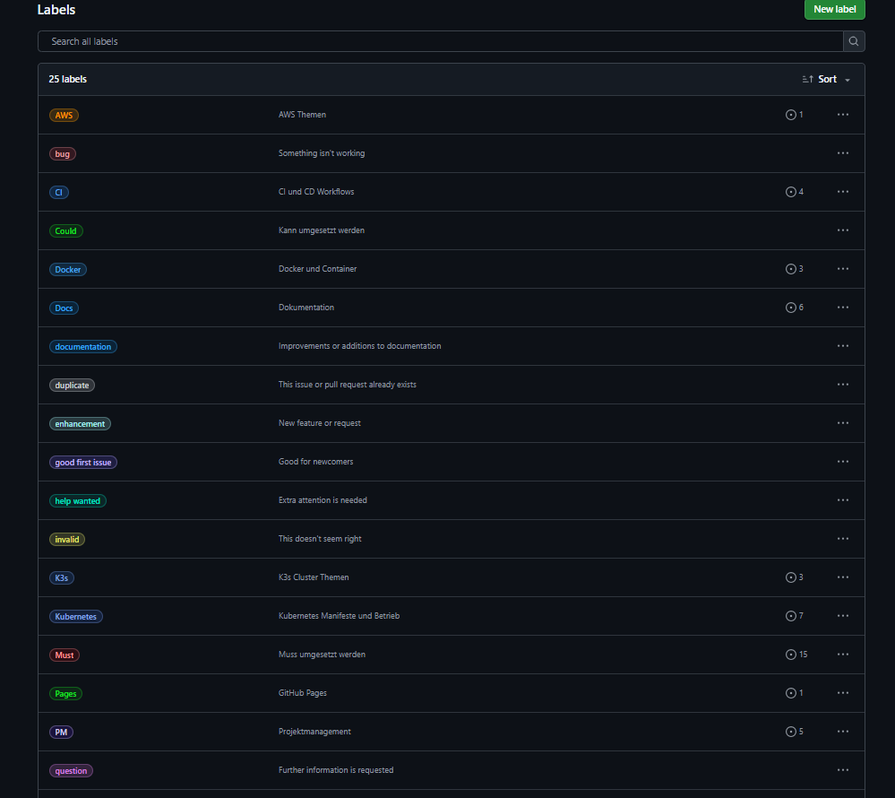
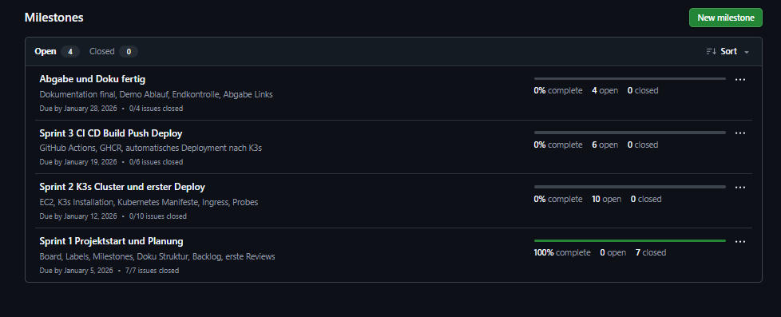

## Sprint 1 – Review und Retrospektive

### 1. Ziel des Sprints
Ziel von Sprint 1 war der **Projektstart sowie der Aufbau der Projektmanagement-Grundlagen**.  
Der Fokus lag nicht auf technischer Umsetzung, sondern auf Struktur, Planung und Nachvollziehbarkeit gemäss agiler Methodik mit Kanban.

Der Sprint bildet die Basis für alle folgenden technischen Arbeiten.

---

### 2. Geplante Inhalte (Sprint Backlog)
Für Sprint 1 wurden folgende Themen definiert:

- **Aufsetzen eines Kanban Boards** mit klaren Spalten
- **Definition von Labels** zur Klassifizierung der Issues
- **Erstellung von Milestones** für Sprints und Abgabe
- **Erfassung aller User Stories** für das Gesamtprojekt
- **Dokumentation der Projektmanagement-Vorgehensweise**
- **Architektur Zielbild als konzeptionelle Grundlage**

---

### 3. Umsetzung im Sprint
Im Verlauf des Sprints wurden die geplanten Inhalte vollständig umgesetzt.

#### 3.1 Kanban Board
Das Kanban Board wurde in GitHub Projects erstellt und umfasst folgende Spalten:

- **Backlog**
- **Ready**
- **In Progress**
- **Review**
- **Done**

Zusätzlich wurde eine WIP-Regel definiert, um parallele Arbeit zu begrenzen.

<small>Bild 1: Kanban Board</small>

---

#### 3.2 Issues und User Stories
Alle relevanten Aufgaben wurden als **User Stories (US01 bis US27)** in GitHub Issues erfasst.  
Jede User Story enthält:

- Beschreibung
- Akzeptanzkriterien als Checkboxen
- Definition of Done

Die Issues sind eindeutig benannt und den entsprechenden Milestones zugeordnet.

<small>Bild 2: Issues</small>

---

#### 3.3 Labels
Zur besseren Strukturierung wurden Labels für folgende Bereiche angelegt:

- Projektmanagement
- Dokumentation
- AWS
- K3s
- Kubernetes
- CI/CD
- Security
- Testing
- Story und Task
- Must, Should, Could

Diese Labels werden in allen folgenden Sprints konsequent verwendet.

<small>Bild 3: Labels</small>

---

#### 3.4 Milestones
Es wurden Milestones für die einzelnen Projektphasen erstellt:

- Sprint 1 Projektstart und Planung
- Sprint 2 K3s Cluster und erster Deploy
- Sprint 3 CI/CD Build Push Deploy
- Abgabe und Dokumentation

Dadurch ist der Projektfortschritt jederzeit nachvollziehbar.

<small>Bild 4: Milestones</small>

---

#### 3.5 Dokumentation
Die Projektdokumentation wurde strukturiert aufgebaut und über **GitHub Pages** veröffentlicht.  
Die Dokumentation umfasst unter anderem:

- Projektdefinition
- Projektmanagement
- Sprint Reviews
- Architektur Zielbild

https://cancani.com/geraeteausleihe-sem4/

---

### 4. Sprint Review (Ergebnisbewertung)

**Sprintziel erreicht:** Ja  

Alle geplanten Inhalte für Sprint 1 wurden umgesetzt.  
Die Projektorganisation ist nun sauber strukturiert, nachvollziehbar dokumentiert und bereit für die technische Umsetzung.

Besonders positiv ist die vollständige Erfassung aller User Stories bereits zu Projektbeginn.

---

### 5. Sprint Retrospektive

#### 5.1 Was lief gut
- Klare Strukturierung des Projekts von Anfang an
- Einheitliche User Stories mit Akzeptanzkriterien
- Kanban Board ermöglicht transparente Arbeitsweise
- Dokumentation ist früh vorhanden und versioniert

#### 5.2 Was war schwierig
- Einstieg in GitHub CLI und Automatisierung der Projektanlage
- Feinabstimmung von Milestones und deren Zuordnung
- Entscheidung für die geeignete Kubernetes Variante

#### 5.3 Verbesserungen für Sprint 2
- Technische Tasks noch granularer aufteilen
- Nachweise direkt während der Umsetzung sichern
- K3s Installation schrittweise dokumentieren

---

### 6. Ausblick auf Sprint 2
In Sprint 2 liegt der Fokus auf der **technischen Basis**:

- Bereitstellung einer AWS EC2 Instanz
- Installation und Konfiguration von K3s
- Erstes Deployment des Microservices
- Verifikation der Container Registry Anbindung

Damit wird der Übergang von Planung zu technischer Umsetzung vollzogen.
